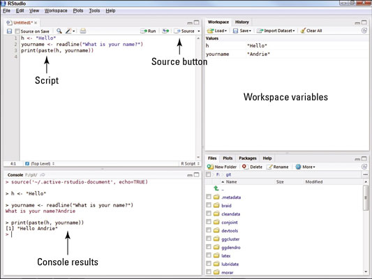
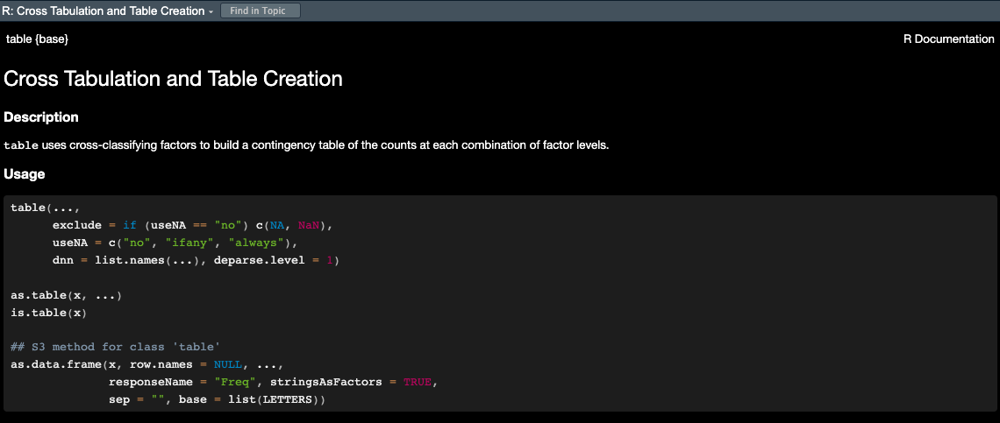
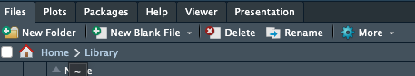
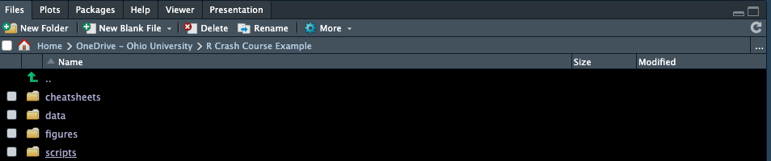

```{r setup, include=FALSE}
knitr::opts_chunk$set(echo = TRUE, 
                      cache = TRUE)
```

```{r echo=FALSE}

#  R Crash Course, Day 1 Module 1   
#      Casa Tisaru Lepsa, Romania             

#  Getting started with R: the basics 

```

Welcome to the 2023 R Crash Course! 

## Get materials for this module

You will be introduced to a lot of new material very quickly in this course, and you are not expected to remember everything! 'Cheat sheets' can quickly and easily refresh your memory about syntax that can be difficult to remember. So don't worry if you don't memorize everything we do together in this course- the key is that you leave here with comfort working in the RStudio environment, doing some basic data operations in R, and most importantly, learning and trying new things on your own!

Below are links to good R "cheat sheets" for this module (we will add more for each module or you can see [links](Links.html) for a list of all cheat sheets):

### RStudio
[Rstudio cheat sheet](https://posit.co/reSources/cheatsheets/) (you will need to scroll down to find the RStudio IDE cheatsheet) 

### Base R
##### (We won't be using base R a ton but it is good to have a solid understanding of the base functions)
[Base R Cheat sheet](https://www.i3s.unice.fr/~malapert/R/pdf/base-r.pdf)        
[R reference card](https://cran.r-project.org/doc/contrib/Short-refcard.pdf)

## Before we begin
Before we begin let's cover what R and RStudio are, and a few useful tips and best practices for keeping your R files organized. 

### What is R and RStudio?
You will recall you downloaded two programs for this course, R and RStudio. R itself is the programming language we will be using and the R application you downloaded is the free software environment that allows your computer to understand the coding language and perform various functions. We almost never work directly in R because it's clunky and not straightforward; instead we work in RStudio. RStudio is a much more user friendly interface to work in. <span style="color: blue;">Open RStudio</span> on your laptop and we will go over the layout and various options in RStudio. You may also want to reference the [Rstudio IDE cheat sheet](https://posit.co/reSources/cheatsheets/) and take any notes you find helpful as we go.

### RStudio Layout (the four windows)
When you open RStudio, you'll see four windows.  



#### 1. Source: 
This is where you write your code. Code that you have written is called your **R script**. Anything you want evaluated in R that you want to be available later is written here. Your code is not evaluated until you run it, this can be done in a couple different ways. As an example type <span style="color: blue;">*2 + 2*</span> into the **source** panel, do not hit enter. Now, with your cursor still on the same line as the code you just wrote, <span style="color: blue;">click the 'Run' button</span> at the top right corner of the **source** panel, this will run your code. 

```{r results=T}

2 + 2

```
 The result or output of your code will appear in the panel below, the **console**. Before we move on to the **console**, let's cover a keyboard shortcut that is a much more efficient way to run your code. 
 
Place your cursor on your line of code again and press <span style="color: blue;">*Ctrl+Enter*</span> (Windows) or <span style="color: blue;">*Command+Enter*</span> (for Mac) and check the **console**. You should see the same output as before.  

(*RStudio has several helpful keyboard shortcuts to make running lines of code easier. [Check this website](https://support.rstudio.com/hc/en-us/articles/200711853-Keyboard-Shortcuts) for a comprehensive set of keyboard shortcuts- or access the shortcuts using help>>keyboard shortcuts.*)

If you have multiple lines of code that you want to run at once, you can also highlight your code and use either of the aforementioned methods to run it. Let's try this. Type <span style="color: blue;">*4 + 4*</span> in the **source** panel below your previous line of code. Highlight both sections with your mouse and use either method to run your code, check the console.
 
 ```{r results=T}

2 + 2
4 + 4

```
#### 2. Console: 
The R **console** (what you see if you opened R directly instead of RStudio) is a **command line** interface, and is *your direct connection with R*: you give R a command at the prompt and R executes that command. The **console** is where your code is evaluated by R, it will show the code you have run followed by any output if there is one. Some code will not have an output in this panel (e.g., graphs), which we will cover more later. The **console** can also be used to write and evaluate code you only need to use once and don't want saved in your script. This is useful for looking up help files, checking the structure of your data, and simple math such as what we just did. Delete the lines of code you wrote in the **source** panel and instead type <span style="color: blue;">*2 + 2*</span> in the console and hit enter. You should get the same output as before, but now that code is not in your **R script** so it won't be evaluated every time you run your script. You can clear your **console** by clicking the broom icon in the right corner, I recommend doing this anytime you start a new analysis in R. Let's do this now, <span style="color: blue;">click the broom icon</span> and see what happens.

#### Tab Panes 
There are two panels with various tabs, the top panel is your **environment/history** and the lower panel contains the **files** window and other tabs.  

#### 3. Environment/History:
The first tab of this panel is the **environment**; this shows you objects that are currently in your working space (environment) such as data, vectors, and graphs. The second tab is your **history** which shows you everything you've evaluated during your current session. You should only see a few lines of simple math that we did earlier (i.e., 2 + 2 & 4 + 4), if you see anything else in your history that means you have run something else in R at an earlier time without closing the program. Similar to the **console**, you can clear both your **environment** and **history** by clicking the broom icon when each tab is selected. Let's do this now, with the **history** tab selected <span style="color: blue;">*click the broom icon*</span>, you will be prompted with a pop-up window, click yes. Now your **history** is empty. Do the same for your **environment**. 

There are more tabs and options in this panel, some of which we will cover later, but for now lets move on to the last panel of RStudio.

#### 4. Files and others:

#### Files:
The last panel contains several tabs including the **files** tab which is useful to see your directory (files). You can check what you have named your data sets, open scripts, etc. without having to navigate out of RStudio. You can also create, delete, and rename folders and files directly in RStudio in this tab. When you click on **files** initially it will open to your current **working directory**, which is the file path on your computer that you are working out of. This is where your R outputs will be stored and should be where any files you want to access on your computer are also stored. 

You can also check your current **working directory** by running the command `getwd()` in the **console**. Do this now, type <span style="color: blue;">*getwd()*</span> in the **console** and hit enter. 
 ```{r results=F}

getwd()

```
What does R return?

If you haven't set your **working directory** yet, R will likely return `/`. If anything else appears then you have already set your **working directory**, don't worry about this for now we will create a directory for this course later. 

#### Plots:
Working left to right let's go through the remaining tabs. The **plots** panel is where graphs and other figures you create in R will appear. <span style="color: blue;">Click the **plots** tab*</span>, since we haven't created any figures there isn't anything to see here yet. 

#### Packages:
This tab is one way that you can install, update, and check which **packages** you have in your works pace. We will cover this tab more later when we start working with **packages**.

#### Help:
 The **help** tab is where you can look up information and **R documentation** about various **functions** you may want to use. Since we haven't covered **functions** yet, we will use some examples from the [Base R Cheat sheet](https://www.i3s.unice.fr/~malapert/R/pdf/base-r.pdf) to show how this panel works. 
 
 

Type <span style="color: blue;">*table*</span> in the search bar in the upper right corner of this panel and hit enter. This brings up the **R documentation** for the base R function `table()`. 

Now let's go over a few other ways to use the **help** window. 

 
 
Look at your Base R Cheat Sheet under the "Getting Help" section. This shows a few other ways you can access the **help** window. The first is by typing a `?` before a **function** and running that code. Let's try it. In the **source** panel type <span style="color: blue;">*?seq*</span> and run the code. 

 ```{r results=T}

?seq

```
This should again open up **R documentation** in the **help** window, but for a different **function**. Now we are looking at the base R function `seq()`. This is useful, but you probably wouldn't want this saved in your **R script** because it would run every time. Instead, we would probably use the **console**. Click out of the **help** window by selecting any other tab in that panel, then cut a paste your code <span style="color: blue;">*?seq*</span> to the **console** and hit enter. This will again open up the **help** window with the information for `seq()`, but now it isn't saved in your script so it won't open the window every time you run the rest of your analysis. 

Let's briefly cover how to read **R documentation** 

* The first line shows the and in {} the **package** the function is in. 

* Description:    
Then a brief description of what the function does.

* Usage:    
Followed by the syntax to use with the function. *This is an important section to check when using a new function* it shows what order you need to provide various objects and arguments. R will read the arguments in each functions and assume they match this order unless you specify otherwise. For example

```{r}

# example of order of operations using seq()
seq(from = 1,
    to = 10,
    by = 1)

# is read the same as
seq(1, 10, 1)

# or
seq(to = 10,
    from = 1,
    by = 1)

# but not the same as
# seq(10, 1, 1) # try this, what happens?
```

* Arguments   
The next section explains what the arguments are in the function including the format they bust be in.

* The next few sections vary depending on the specifics of the function 

* Examples:   
The last section is where examples are provided so you can see how to use the functions with real data, as they usually use data in R or create fake data for the example you can often opy and paste these examples directly to your R script to see how they work and then adapt them to your code.


We won't cover the Viewer and Presentation tabs in this course so let's move on to a few other features of the RStudio environment.

### Explore RStudio Environment
Let's explore a few more features of the RStudio environment before moving on. On your own see if you can;  

1. locate how to create a new R script file  

2. save your script   

3. search within your script  

(your RStudio IDE Cheat Sheet will be helpful for this).

Try not to scroll down past the RStudio Cheat Sheet or you will see the answers!


#### Opening a new file
To open a new file you click the page with the green '+' in the upper left corner. This will prompt a drop-down menu where you can select the type of file you want to create. We will primarily be using the R script option.

#### Saving your code
To save your code for the first time you select "File>>Save as". Once you have saved a file before you can click the blue floppy disk icon in the task bar at the top of the **source** panel to save it again. Whenever you have unsaved changes to your script the name of your file will appear in blue text instead of white text, this indicates that you need to save. Try typing something in your current **R script** to check this.

#### Find and replace
You can search for words and **functions** in your **R script** by clicking the magnifying glass icon. This will open another task bar with fields for 'find' and replace'. We will use this feature more later in the course.

## Get set up for this course

### File organization
The last thing I want to cover is file organization. Keeping your **R scripts**, data, and figures organized will allow you to more efficiently and effectively use R and will result in fewer issues as you work with more complex analyses. 

Let's start by creating a folder for this course, we will use the **files** tab in the bottom right panel to do this. <span style="color: blue;">Click on **files**</span>, then next to the house icon navigate through your computer's files to an area you want the materials for this course to be stored.



Once you've selected a location for the course files to live we are going to create several new folders by clicking the 'new folder' icon, <span style="color: blue;">start by making a master folder labeled *'R Crash Course'*</span>. Then create the following folders within the 'R Crash Course' master folder.

1. data

2. scripts

3. figures

4. cheatsheets

*notice I used all lowercase letters for my internal folders, this makes it quicker to type in R and leads to fewer mistakes/errors that can arise from case sensitivity.* 



Once you have created the folders above, <span style="color: blue;">click the data folder</span> and then within the data folder we will create two additional folders,

1. raw

2. processed

I was taught this basic file structure in and R course that I took as a graduate student and it is one I really like. I think this works well for most analyses with some variation.


### download script for day1_1
Click [here](day1_1.R) to download the script for this module! I recommend right-clicking (or command-clicking for Macs) on the link and selecting the "Save As" option from the context menu. Save the script to the 'scripts' folder in the 'R Crash Course' folder we just created, which will serve as your **working directory** for this course. 

### Open day1_1 script
To open this script in RStudio, we will use the **files** tab again. If this tab is not already open, open it and navigate to the 'scripts' folder, then <span style="color: blue;">click the day1_1.R script</span> this will automatically open this script in your current RStudio session.

### Setting your working directory
Before we can start coding we need to set our **working directory** which essentially just tells R where on your computer it should save outputs to and where to find data you want to read in. There are a couple ways to do this.

1. You can go to the 'Session' tab at the top of RStudio and select 'set working directory' from the drop down menu. From there you. will see a few options for where to set the directory or you can select 'Choose directory'.

2. You can also set your **working directory** in the console or in your **R script** using the **function** setwd(). Try this, <span style="color: blue;">set your working directory to the 'R Crash Course' folder you created using setwd()</span>. 

Remember, you can easily check your file path in the **files** panel so you don't have to navigate out of R to do this.

 ```{r results=T}

setwd("/Users/marissadyck/Library/CloudStorage/OneDrive-OhioUniversity/R Crash Course")

```

**NOTE:** when you put file paths in R, they need to use forward slashes ("/"; or double backslashes, "\\\\") -- single backslashes ("\\", as seen in Windows) do not work for specifying file paths in R. 

One thing to remember about setting your working directory is you have to do it every time you open a new R session. For example if you save this script and close R and then open it again tomorrow you have to reset your **working directory** before you begin. Therefore, it can be useful to write the setwd() function at the top of your script. However, if someone else wants to use your **R script** they have to have the exact same**working directory** as you or they have to change the **working directory** before they can run the code. This is inefficient and can lead to issues when sharing code. Luckily there is an easier way! **RStudio projects**.

### Working in projects
A **RStudio project** is simply a **working directory** in the form of a file that is saved on your computer much like an **R script** wherever you want your **working directory** to be and is designated with a .RProj file extension. When you open a project the **working directory** will be automatically set. Therefore you don't have to run setwd() each time you start R and you can share a **Rstudio project** and associated files (e.g., scripts and data) with others and the directory will automatically be set wherever they save those files.

Let's try this, start a new **RStudio Project**. To do this, <span style="color: blue;">click the 'Project' option in the upper right corner</span> (it should currently read 'Project (None). Then select new project. In the menu that follows, select "Existing Directory", and then navigate to R Crash Course folder. Select this folder to be your **project directory**. Every time you open this project (File >> Open Project), this project directory will be the first place that R looks for data files and code, and will be the default location for saving data and code.  

Now we are ready to do some coding!


## Coding best practices

### Make a new script

If you haven't done it already, create a new R script by clicking on the "blank paper" icon at the far left of the RStudio toolbar (or File>>New File>>R script). The top left quadrant of the RStudio interface (at least by default) should now contain a blank R script.

Before we start we'll cover a few organization tips that will help keep your code organized and easily repeatable. Future you will thank past you for using these best practices!

### Comments
You may have noticed already that some lines are preceded by a hash tag `#` R ignores these lines (as in it doesn't try to evaluate them)- they are called **comments**, and they help to keep code organized and understandable. 

_Use comments early and often- they are tremendously valuable_.   

### Headers
You can create sections headers throughout your code to separate chunks of code. Let's create a section header now title '*intro to base R*'. To do this <span style="color: blue;">use the keyboard shortcut *Ctrl + shift + R* (Windows) or *Cmd + Shift + R* (Mac)</span>. This will open a window where you can type the text for your section header.

**Headers** are added to a table of contents of sort at the bottom left of your **source** panel.You can easily navigate between section headers using this feature. This is particularly useful when your **R scripts** become very lengthy.

### Global Options
Your **global options** can be found under the '*Tools*' tab at the top of the RStudio environment. Navigate there now and we will change a few settings. 

1. <span style="color: blue;">*Soft wrap* your code</span>. This means that if your code extends outside the **source** window it will automatically wrap to the next line so you don't have to scroll to see your code and comments. To do this navigate to '*Code*' and make sure '*Soft-wrap R source files*' is checked.


2. Next, change your **editor theme** (code appearance) so that different colors are used to indicate **comments**, **functions**, paired parentheses, etc. I prefer a black background and have selected the '*Tomorrow Night Bright*' theme but play around with a few options to choose which one is most pleasing for you.


That's all we will change for now but you can come back to **global options** later to change other settings if you want.

### Code formatting
You'll notice throughout the course that I try to follow some basic rules for R code formatting which I learned in a prior course. These rules, while not everyone follows, I have certainly found useful and make your code much easier to follow. If these don't all make sense now that is okay, we will cover them later on.

Code Spacing:  
* Maintain one blank line between code blocks.  
* Maintain one blank line between code blocks and comments or section headers.  (*I don't always agree with this one*)
* All assignment and logical operators should be separated from other code by a leading and a trailing space.  
* Commas should be separated from other code by a trailing space but not a leading space.  
* Hash tags should be separated from comment text by a trailing space.  

Assignment:  
* Objects that are used in the creation of a parent object and not used again should not be assigned to the global environment.  
* Assigned names should be in all lowercase with multiple words should be separate by a _.  
* Only use `=` when providing values to the formals of a function – in all other instances use the `<-` assignment operator.  
* All global assignments live on their own line.  

Functions:  
* Each formal of a function (i.e., argument) lives on its own line.   
* There should be no more than one call to a named function per line of code.  

## Base R
You may here people use the term **base R** when working in RStudio. This simply refers to the built-in functions and operations that R can perform without loading any **packages**. We will cover packages more later, but for now your [Base R Cheat sheet](https://iqss.github.io/dss-workshops/R/Rintro/base-r-cheat-sheet.pdf) will come in handy.


R Objects
### Objects
We have already covered that R can compute mathmatical equations, but what if we want to create an **object** and save it in R. Let's create our first **object**. **Objects** are defined using R's **assignment operator** (Windows shortcut: Alt + -)(Mac: Option + -), which looks like a left arrow (`<-`). <span style="color: blue;">Type the following statement</span> directly into the **console**:

```

my_obj <- 6+11

```
Then hit "Enter". What does R return (e.g. look at the **console**)? 

NOTHING!

BUT.... check the **environment**. You should see that you now have a new **object** in your environment, called `myname`, and this object contains a single **text string**. Simply checking the **environment** works to view this simple object but for more complex objects you may want to print them in the console or open another window to view them.

To print an object type the object name in either your **source** if you want it to print every time you run your code, or the **console** to just view it once.

To view an object you can type the function *View()* with your object name in the parentheses or click on the object in the **environment** window. 

<span style="color: blue;"> Print **and** view your object</span> using any of the methods described above.

NOTE: RStudio has a useful auto-fill feature, which can save you lots of time and headaches. After you've typed the first couple letters (e.g., "my"), RStudio will suggest "my_obj" (or use the "tab" key to trigger RStudio to give you autofill options) and you can just scroll to the right object/function and hit "Enter"! The auto-type feature, unlike R, is not case sensitive!  


In your blank script, let's define a new object. For example:

```{r results=F}

# create object my_name
my_name <- 'Marissa Dyck'  # use your name.

```

Now run that line of code. You should see a new **object** ('my_name') pop up in your **environment**.

Notice how for this **object** we put quotations `''` or `""` around the text. That is because words and letters are **characters** and not **numeric** variables so R recognized them differently.

<span style="color: blue;">Try creating the same object without the quotes</span>. What happens? You get an Error message right? This is because without the quotes R assumes you are referring to an **object** you have created called '*your name*' but it doesn't exits. We will cover data types more in a minute.

Of course, it's always a good idea to save your scripts often -- save this script in your 'scripts' folder using 'file' > 'save as' and title it <span style="color: blue;">'my_script_day1_1"</span>.

### Types of R objects
R has many different kinds of objects that you can define and store in memory. 

Objects that enable storage of information (data objects) include: **vectors**, **matrices**, **lists**, and **data frames**.

Objects that transform data and perform operations (e.g., statistics/visualizations) on data objects are called **functions**.

### Load an Existing script

Remember the file you downloaded at the beginning of this module? That file is an R script (["day1_1.R"](day1_1.R)); Let's click back to it now.

### Functions

Functions are routines that take inputs (usually data objects) (also called **arguments**) and produce something useful in return (transformed data objects, summaries, plots, tables, statistics, files). 

In R, the name of the function is followed by parentheses, and any arguments (inputs) are entered inside the parentheses. The basic syntax looks like the code snippet below.

{width=25%}

```
## function syntax
functionName([argument 1, argument2, ...])
```

If you don't type the parenthesis, the function is not run- instead, the function definition is shown. 

Here are some examples of how functions are used. Note the parentheses!

```{r results = T}

# functions ------------------- 

# sum
sum(1, 2, 3, 10)    # returns: 15

# combine
c(1, 2, 3, 10)   # combine four numbers into a single data object (a vector!)

# floor
floor(67.8)  # removes the decimal component of a number

# round
round(67.8)  # rounds a number

round    # oops, forgot the parentheses!

```

Remember, it's easy to get some help if you forget how a function works, <span style="color: blue;">Try accessing a help file for *round()*</span> using one of the methods we covered earlier. 

```{r class.source = 'fold-hide'}

?round        


```


### Data objects and variables

#### Data types

The basic data types in R are:

+ **numeric** (numbers)      
+ **character** (text strings)
+ **logical** (TRUE/FALSE)    
+ **factor** (categorical) 

Data of each of these types can be represented as **scalars**, **vectors**, **matrices**, **lists**, and **data frames**

#### Scalars

Scalars are the simplest data objects. A scalar is just a single value of any data type.

```{r results=F}


#  Create R Objects ------------------------


# scalars 
scalar1 <- 'this is a scalar'

scalar2 <- 104

```

Scalars can store information of any type. In the example above, `scalar1` is a character, `scalar2` is numeric. 

*If you're uncertain about the type of any R object the R function use the `typeof()` function.*

#### Vectors
**Vectors** are strings (single dimensional) of values (can be numbers or characters) which are created following the syntax below. Vectors can combine multiple scalars in a single data object. In fact, a scalar in R is really just a vector of length 1.

```{r results=T}
# VECTORS
vector1 <- c(1, 2, 3, 4)  

# print vector1
vector1
```

In the code above we used a function called `c()`which is a '*combine*' **function**- it takes several smaller data objects and combines them together into a single object. We will be using this **function** a lot. 

There's a many different ways to create a  **vector**. Let's see some examples of ways we can create the same vector above more efficiently.
```{r results=T}

# create a vector of numbers 1 to 4 using ':'
vector2 <- 1:4  

# print vector2
vector2

# create a vector of numbers 1 to 4 using seq()
vector3 <- seq(1, 4, by = 1)

# print vector 3
vector3

# create a vector of numbers 1 to 4 using 'c'
vector4 <- c(1, 4)

# print vector 4
vector4
```

Notice, each **vector** is composed of one or more **scalar** elements of the same type. If you try to create a vector combining **numeric** and **character** elements you will get an error. You can try this in the **console** now.

Now let's do some stuff with vectors!

```{r results= T}

# make a vector of 1, 2, and 3
d1 <- 1:3  

d1
          
# add 3 to all elements of the vector d1
d2 <- d1 + 3  

d2

# elemntwise addition
d3 <- d1 + d2

d3

# check the number of elements in a vector
length(d1)           

# sum all the elements in a vector
sum(d3)              

# extract the second element in a vector
d2[2]                 

```


#### Matrices

**Matrix** data objects have two **dimensions**: rows and columns. All of the elements in a matrix must be of the same type. 

Let's make our first matrix. One simple way to make a matrix is just by joining two or more vectors using the function `cbind()` (bind vectors or matrices together by column) or `rbind()` (bind vectors or matrices together by row)

```{r}

# MATRICES

# create a matrix by binding vectors, with vector d1 as column 1 and d2 as column 2
mymat <- cbind(d1, d2)

mymat

# confirm that the new object "mymat" is a matrix using the 'class()' function
class(mymat)   

 # create matrix another way (matrix constructor)
mymat <- matrix(
  c(1,2,3,4,5,6),
  nrow = 3,
  ncol = 2)  

mymat

```


We can do stuff with matrices too!

```{r}

# math with matrices

mymat + 2

sum(mymat)

# extract matrix elements

# extract the element in the 3rd row, 2nd column
mymat[3, 2]  

mymat[, 1]     # extract the entire first column

# Syntax for using []
# X[a,b]       access row a, column b element of matrix/data frame X
# X[,b]        access all rows of column b of matrix/data frame X
# X[a,]        access row a of matrix/data frame X

```

Notice, when using `[]` with vectors you only need one value to reference the element's position, however with matrices you need two values to specify the row (first) and the column (second).

#### Lists

**Lists** are more general than matrices. **List** objects are just a bunch of arbitrary R data objects (called **list elements**) grouped together into a single object! The elements of a list don't need to be the same length or the same type. The elements of a list can be **vectors**, **matrices**, other **lists**, or even **functions**.  

Let's make our first list:

```{r}

# LISTS

# create an empty list
mylist <- list()

# add elements to the empty list
mylist[[1]] <- c(1, 2, 3)     # note the double brackets- this is one way to reference list elements. 

mylist[[2]] <- c('piatra','craiului')

mylist[[3]] <- matrix(1:6,
                      nrow = 2)

# print mylist
mylist

# do stuff with lists

# extract the second list element
mylist[[2]]    

# extract the first row, second column from the matrix that is embedded as the third element in this list !
mylist[[3]][1,2]      

```

##### Data frames and tibbles

**Data frame** objects are the basic data storage object in R. Data frames are a special type of **list** in which each list element is a *vector* of equal length. Each list element in a data frame is also known as a *column*. 

Data frames superficially resemble matrices, since both have rows and columns. However, unlike matrices, the columns of a data frame can represent different data types (i.e., character, logical, numeric, factor), and can thereby represent different types of information!  

_Data frames are the fundamental data storage structure in R_. You can think of a data frame like a spreadsheet. Each row of the the data frame represents a different observation, and each column represents a different measurement taken on each observation unit. 

Let's make our first data frame. 

```{r}

# DATA FRAMES 

 # create a data frame with two columns. Each column is a vector of length 3
df1 <- data.frame(col1 = c(1,2,3),
                  col2 = c("A","A","B")) 

df1

# extract the first element in the second column
df1[1, 2]    

# extract the second column by name (alternatively, df1[["col2"]])
df1$col2    

```

Now we have a data frame with three observation units and two measurements (variables).

A **tibble** is the same thing as a data frame, just with a few tweaks to make it work better in the **tidyverse**. We will primarily work with tibble data frames in this course. For our purposes right now, tibbles and data frames are the same thing.

## Making up data!

In this section, we will make up some fake data objects. In the next module we'll practice working with real data! 

### Generating sequences of numbers

One task that comes up a lot is generating sequences of numbers:

```{r}

# MAKING UP DATA!  ----------------------------------

# Generating vector sequences  

# sequential vector from 1 to 10
1:10            

# sequence of length 5 between 0 and 1 
seq(0, 1, length = 5)         

```

### Repeating sequences
Another task is to group regular recurring sequences together:

```{r}

# Repeating vector sequences 

# repeat 0 three times
rep(0, 
    times = 3) 

# repeat the vector 1:3 twice
rep(1:3, 
    times = 2) 

# repeat each element of 1:3 two times
rep(1:3, 
    each = 2)              

```

### Random number generator
We can also fill up a vector with random numbers using one of R's built in random number generators:

```{r}

# Random numbers 

# 10 samples from std. normal
rnorm(10)                    

# 10 samples from Normal(-2,4^2)
rnorm(10, 
      mean= -2, 
      sd = 4)      

# 5 samples from Binom(3,0.5)
rbinom(5,
       size = 3,
       prob = .5)  

# 5 samples from Binom(3,0.1)
rbinom(5, 3, .1)            

# 10 standard uniform random numbers
runif(10)  

  # 10 uniform random numbers from [-1,1]
runif(10,
      min = -1,
      max = 1)      

```

### Making fake data
And finally, we can make up a fake data frame (or tibble) using some of the tricks we just learned!

```{r}

# Make up an entire fake data frame!

my.data <- tibble(
  Obs.Id = 1:100,
  Treatment = rep(c("A","B","C","D","E"),
                  each = 20),
  Block = rep(1:20,
              times = 5),
  Germination = rpois(100,
                      lambda = rep(c(1,5,4,7,1),
                                   each = 20)),   # random poisson variable
  AvgHeight = rnorm(100,
                    mean = rep(c(10,30,31,25,35,7),
                               each = 20))
)

my.data

# Use the "summary()" function to summarize each column in the data frame.
summary(my.data)   

# extract rows 21 to 30 and store as a new data frame
mydf = my.data[21:30, ]  

mydf

# access a column of the data frame by name
mydf$Treatment 

```

### R functions to explore data
Here are some useful R functions for exploring data **objects**. We will cover these in more depth later but take a look at the outputs for each now.

```{r eval=FALSE}

# Useful data exploration/checking tools in R --------------------

# Obtain length (# elements) of vector d2
length(d2)  

# Obtain dimensions of matrix or array
dim(mymat)

# summarize columns in a data frame. 
summary(my.data)

# look at the "internals" of an object (useful for making sense of complex objects!)
str(my.data) 

# get names of variables in a data frame (or names of elements in a named vector)
names(my.data) 

# get number of rows/observations in a data frame
nrow(my.data) 

# get number of columns/variables in a data frame
ncol(my.data)     
     

```


## Practice problems
Below are some practice problems for you to work through based on the material we just covered. For all exercises the result is shown immediately after the question but the code is hidden. Try your best to tackle the problems without checking the answers, remember you can always look up information for a particular **function** using `?function name`to open the **help** window. Once you think you've got it you can check your code against mine by clicking the 'code' icon to the upper right of the answer.

### 1 Create a vector
Create a vector called 'myvec' using any of the methods you learned with numbers 1 to 10. *Note there are multiple ways to do this*. 

```{r class.source = 'fold-hide'}

# answer 1 (the most parsimonious)
myvec <- 1:10

# answer 2
myvec <- c(1, 10)

# answer 3 (time consuming)
myvec <- c(1, 2, 3, 4, 5, 6, 7, 8, 9, 10)

# answer 4 (unecessarily complicated for this exercise)
myvec <- seq(1, 10, by = 1)
```

### 2 Create a matrix with `rbind()`
Create a 3 row by 2 column matrix named 'mymat'. Use the `rbind()` **function** to bind the following three rows/vecotors together:

```
c(1,4) 
c(2,5) 
c(3,6)
```

```{r class.source = 'fold-hide'}

rbind(
c(1,4),
c(2,5),
c(3,6)
)

```

### 3 Extracting objects from data
Check get the names of columns in the data frame you created earlier 'mydf'. *Hint see the R functions to explore data section*. Then extract all rows for column 5 by name, do the same thing using the element position e.g. `[]`
```{r class.source = 'fold-hide'}

names(mydf)

mydf$AvgHeight

mydf[, 5]

```

### 4 Create a matrix
Create a new matrix called 'mymat2' that includes all the data from columns 3 to 5 of data frame mydf. *HINT: use the `as.matrix()` function to coerce a data frame into a matrix. Since we didn't cover this function you may need to look it up in the help files.*

```{r class.source = 'fold-hide'}

as.matrix(mydf[, 3:5])

```


### 5 Create a list
Create a list named 'mylist' that is composed of a vector: 1:3, a matrix: matrix(1:6, nrow = 3, ncol = 2), and a data frame: data.frame(x =c (1, 2, 3), y = c(TRUE, FALSE, TRUE), z = c("a", "a", "b")).

```{r class.source = 'fold-hide'}

#create an empty list
mylist <- list()

# add a vector of 1 to 3 to the list
mylist[[1]] <- 1:3

# add a matrix to the list
mylist[[2]] <- matrix(1:6,
                      nrow = 3,
                      ncol = 2)

# add a data frame to the list
mylist[[3]] <- data.frame(x = c(1, 2,3 ),
                          y = c(TRUE, FALSE, TRUE),
                          z = c("a", "a", "b"))

# print the list
mylist

```

### 6 Extracting objects from lists
Extract the second and third observation from the 1st column of the data frame in 'mylist' (the list created above). 

```{r class.source = 'fold-hide'}

# call mylist then reference the position of the data frame in the list [[3]], then the column in the data frame [[1]], and finally the observations within that columns c(2, 3)
mylist[[3]][[1]][c(2, 3)]

```

[--go to next module--](day1_2.html)


