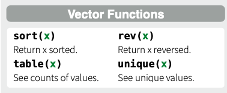
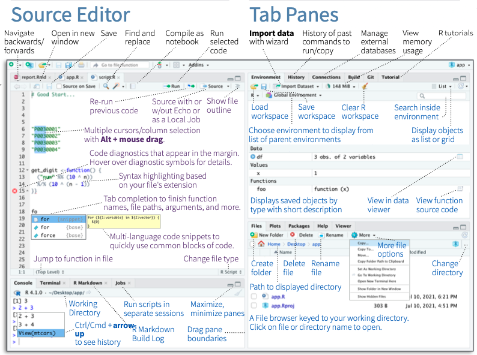
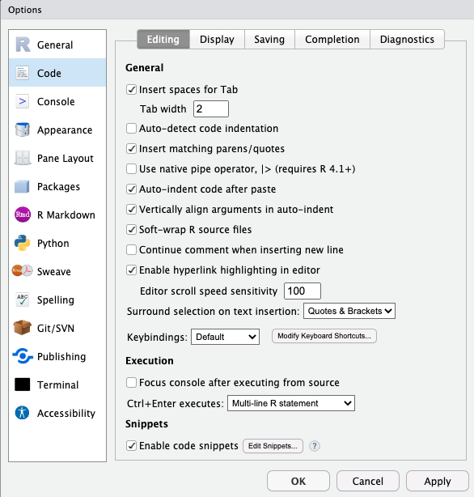
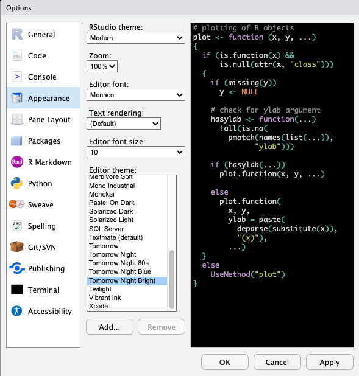

```{r setup, include=FALSE}
knitr::opts_chunk$set(echo = TRUE, 
                      cache = TRUE)
```

```{r echo=FALSE}

#  ES482 R labs   
#      University of Victoria, Victoria BC Canada             

#  Module 1: R basics

library(ggplot2)
library(dplyr)
```

Welcome to the 2024 ES482 R labs! 

## Materials

At the start of each module there will be section to download necessary materials (e.g. scripts, cheat sheets, etc.)

### Cheat Sheets
You will be introduced to a lot of new material very quickly in this course, and you are not expected to remember everything! 'Cheat sheets' can quickly and easily refresh your memory about syntax that can be difficult to remember. So don't worry if you don't memorize everything we do together in this course- the key is that you leave here with comfort working in the RStudio environment, doing some basic data operations in R, working through an analysis in R, and most importantly, learning and trying new things on your own!

Below are links to good R "cheat sheets" for today's lab (we will add more for each today's lab or you can see [links](Links.html) for a list of all cheat sheets):

RStudio
[Rstudio cheat sheet](https://posit.co/reSources/cheatsheets/) (you will need to scroll down to find the RStudio IDE cheatsheet)     

Base R
(We won't be using base R a ton but it is good to have a solid understanding of the base functions)   
[Base R Cheat sheet](https://www.i3s.unice.fr/~malapert/R/pdf/base-r.pdf)        
[R reference card](https://cran.r-project.org/doc/contrib/Short-refcard.pdf)

## What is R and RStudio?
You will recall you downloaded two programs for this course, R and RStudio. R itself is the programming language we will be using and the R application you downloaded is the free software environment that allows your computer to understand the coding language and perform various functions. We almost never work directly in R because it's clunky and not straightforward; instead we work in RStudio. RStudio is a much more user friendly interface to work in. <span style="color: blue;">Open RStudio</span> on your laptop and we will go over the layout and various options in RStudio. You may also want to reference the [Rstudio IDE cheat sheet](https://posit.co/reSources/cheatsheets/) and take any notes you find helpful as we go.

### Terms
Terms that may be unfamiliar and useful to know are bolded throughout the course. You can access a list of these terms with definitions below:

[Terms](terms.html)

### RStudio Layout (the four windows)
When you open RStudio, you'll see four windows.

{width=80%}

#### 1. Source: 
This is where you write your code. Code that you have written is called your **R script**. Anything you want evaluated in R that you want to be available later is written here. Your code is not evaluated until you run it, this can be done in a couple different ways. As an example type <span style="color: blue;">*2 + 2*</span> into the **source** panel, do not hit enter. Now, with your cursor still on the same line as the code you just wrote, <span style="color: blue;">click the 'Run' button</span> at the top right corner of the **source** panel, this will run your code. 

```{r results=T, echo = FALSE}

2 + 2

```
 The result or output of your code will appear in the panel below, the **console**. Before we move on to the **console**, let's cover a keyboard shortcut that is a much more efficient way to run your code. 
 
Place your cursor on your line of code again and press <span style="color: blue;">*Ctrl+Enter*</span> (Windows) or <span style="color: blue;">*Command+Enter*</span> (for Mac) and check the **console**. You should see the same output as before.  

(*RStudio has several helpful keyboard shortcuts to make running lines of code easier. [Check this website](https://support.rstudio.com/hc/en-us/articles/200711853-Keyboard-Shortcuts) for a comprehensive set of keyboard shortcuts- or access the shortcuts using help>>keyboard shortcuts.*)

If you have multiple lines of code that you want to run at once, you can also highlight your code and use either of the aforementioned methods to run it. Let's try this. Type <span style="color: blue;">*4 + 4*</span> in the **source** panel below your previous line of code. Highlight both sections with your mouse and use either method to run your code, check the console.
 
 ```{r results=T, echo=FALSE}

2 + 2
4 + 4

```
#### 2. Console: 
The R **console** (what you see if you opened R directly instead of RStudio) is a **command line** interface, and is *your direct connection with R*: you give R a command at the prompt and R executes that command. The **console** is where your code is evaluated by R, it will show the code you have run followed by any output if there is one. Some code will not have an output in this panel (e.g., graphs), which we will cover more later. The **console** can also be used to write and evaluate code you only need to use once and don't want saved in your script. This is useful for looking up help files, checking the structure of your data, and simple math such as what we just did. Delete the lines of code you wrote in the **source** panel and instead type <span style="color: blue;">*2 + 2*</span> in the console and hit enter. You should get the same output as before, but now that code is not in your **R script** so it won't be evaluated every time you run your script. You can clear your **console** by clicking the broom icon in the right corner, I recommend doing this anytime you start a new analysis in R. Let's do this now, <span style="color: blue;">click the broom icon</span> and see what happens.

#### Tab Panes 
There are two windows with various tabs on the right, the top window is your **environment/history** and the lower window contains the **files** window and other tabs.  

#### 3. Environment/History:
The first tab of this window is the **environment**; this shows you objects that are currently in your working space (environment) such as data, vectors, and graphs. The second tab is your **history** which shows you everything you've evaluated during your current session. You should only see a few lines of simple math that we did earlier (i.e., 2 + 2 & 4 + 4), if you see anything else in your history that means you have run something else in R at an earlier time without closing the program. Similar to the **console**, you can clear both your **environment** and **history** by clicking the broom icon when each tab is selected. Let's do this now, with the **history** tab selected <span style="color: blue;">*click the broom icon*</span>, you will be prompted with a pop-up window, click yes. Now your **history** is empty. Do the same for your **environment**. 

There are more tabs and options in this window, some of which we will cover later, but for now lets move on to the last window of RStudio.

#### 4. Files and others:

#### Files:
The last window contains several tabs including **files** which is useful to see your directory (where you are working in your computer). You can check what you have named your data sets, open scripts, etc. without having to navigate out of RStudio. You can also create, delete, and rename folders and files directly in RStudio in this tab. When you click on **files** initially it will open to your current **working directory**, which is the file path on your computer that you are working out of. This is where your R outputs will be stored and should be where any files you want to access on your computer are also stored. 

You can also check your current **working directory** by running the command `getwd()` in the **console**. Do this now, type <span style="color: blue;">*getwd()*</span> in the **console** and hit enter. 

```{r results=F, echo=FALSE}

getwd()

```

What does R return?

If you haven't set your **working directory** yet, R will likely return `/`. If anything else appears then you have already set your **working directory**, don't worry about this for now we will create a **project directory** for this course later. 

#### Plots:
Working left to right let's go through the remaining tabs. The **plots** panel is where graphs and other figures you create in R will appear. <span style="color: blue;">Click the **plots** tab*</span>, since we haven't created any figures there isn't anything to see here yet. 

#### Packages:
This tab is one way that you can install, update, and check which **packages** you have in your works pace. We will cover this tab more later when we start working with **packages**.

#### Help:
The **help** tab is where you can look up information and **R documentation** about various **functions** you may want to use. Since we haven't covered **functions** yet, we will use some examples from the [Base R Cheat sheet](https://www.i3s.unice.fr/~malapert/R/pdf/base-r.pdf) to show how this panel works. 
 
 

Type <span style="color: blue;">*table*</span> in the search bar in the upper right corner of this panel and hit enter. This brings up the **R documentation** for the base R function `table()`. 

Now let's go over a few other ways to use the **help** window. 

 
 
Look at your Base R Cheat Sheet under the "Getting Help" section. This shows a few other ways you can access the **help** panel. The first is by typing a `?` before a **function** and running that code. Let's try it. In the **source** panel type <span style="color: blue;">*?seq*</span> and run the code. 

```{r results = T}

# Using the help file ----------------------

?seq

```

This should again open up **R documentation** in the **help** window, but for a different **function**. Now we are looking at the base R function `seq()`. This is useful, but you probably wouldn't want this saved in your **R script** because it would run every time you run your code. Instead, we would probably use the **console**. Click out of the **help** window by selecting any other tab in that window, then cut a paste your code <span style="color: blue;">*?seq*</span> to the **console** and hit enter. This will again open up the **help** window with the information for `seq()`, but now it isn't saved in your script so it won't open the window every time you run the rest of your code. 

Let's briefly cover how to read **R documentation** 

* The first line shows the **function** and in {} the **package** the **function** is in. 

* Description:    
Then a brief description of what the **function** does.

* Usage:    
Followed by the syntax to use with the **function**. *This is an important section to check when using a new function* it shows what order you need to provide various objects and arguments. R will read the arguments in your code in this order and assume they match  unless you specify otherwise. For example

```{r}
  
# example of order of operations using seq()
seq(from = 1,
    to = 10,
    by = 1)

# the below is read the same as above even though we didn't supply the from =, to =, and by = arguments because this is they are in the specified for this function
seq(1, 10, 1)

# as long as we specify the arguments we can also enter them in a different order
seq(to = 10,
    from = 1,
    by = 1)

# but not the same as
# seq(10, 1, 1) # try this, what happens?
```

* Arguments   
The next section explains what the arguments are in the function including the format they bust be in.

* The next few sections vary depending on the specifics of the function 

* Examples:   
The last section is where examples are provided so you can see how to use the functions with real data, as they usually use data in R or create fake data for the example you can often opy and paste these examples directly to your R script to see how they work and then adapt them to your code.


We won't cover the Viewer and Presentation tabs in this course so let's move on to a few other features of the RStudio environment.

### Explore RStudio Environment
Let's explore a few more features of the RStudio environment before moving on. On your own see if you can;  

1. locate how to create a new R script file  

2. save your script   

3. search and replace within your script  

(your RStudio IDE Cheat Sheet will be helpful for this).

Try not to scroll down past the RStudio Cheat Sheet or you will see the answers!



#### Opening a new file
To open a new file you click the page with the green '+' in the upper left corner. This will prompt a drop-down menu where you can select the type of file you want to create. We will primarily be using the R script option.

#### Saving your code
To save your code for the first time you select "File>>Save as". Once you have saved a file before you can click the blue floppy disk icon in the task bar at the top of the **source** panel to save it again. Whenever you have unsaved changes to your script the name of your file will appear in blue text instead of white text, this indicates that you need to save. Try typing something in your current **R script** to check this.

#### Find and replace
You can search for words and **functions** in your **R script** by clicking the magnifying glass icon. This will open another task bar with fields for 'find' and replace'. This feature can be useful for example if you have copied code and need to replace many entries within the script (e.g., data, variables, etc.).

## Get set up for this course

### File organization
The last thing I want to cover is file organization. Keeping your **R scripts**, data, and figures organized will allow you to more efficiently and effectively use R and will result in fewer issues as you work with more complex analyses. 

Let's start by creating a folder for this course, we will use the **files** tab in the bottom right panel to do this. <span style="color: blue;">Click on **files**</span>, then next to the house icon navigate through your computer's files to an area you want the materials for this course to be stored.


Once you've selected a location for the course files to live we are going to create several new folders by clicking the 'new folder' icon, <span style="color: blue;">start by making a master folder labeled *'R labs'*</span>. Then create the following folders within the 'R labs' master folder. To do this, <span style="color: blue;">click the R labs folder </span> then use the new folder icon again.

1. data

2. scripts

3. figures

4. cheatsheets

*notice I used all lowercase letters for my internal folders, this makes it quicker to type in R and leads to fewer mistakes/errors that can arise from case sensitivity.* 


*Ignore that my images say 'R Crash Course Example' as the master folder, this was the title of another similar course I taught*

Once you have created the folders above, <span style="color: blue;">click the data folder</span> and then within the data folder we will create two additional folders,

1. raw

2. processed

I was taught this basic file structure in a R course that I took as a graduate student and it is one I really like. I think this works well for most analyses with some variation.

### Add cheat sheets to folder
Now, staying in Rstudio move any cheat sheets you have already downloaded to the cheat sheets folder you just created. To do this first navigate to where you saved the cheat sheets at the start of lab, select all the files, and using the cog icon after 'rename' to open a drop down menu of additional options. Select 'Move...' and then navigate back to your cheatsheets folder to move the selected files to this location.

### Download script for today
Click [here](mod_2_baseR.R) to download the script for this today's lab! I recommend right-clicking (or command-clicking for Macs) on the link and selecting the "Save As" option from the context menu. Save the script to the 'scripts' folder in the 'R Crash Course' folder we just created, which will serve as your **working directory** for this course. 

### Open script
To open this script in RStudio, we will use the **files** tab again. If this tab is not already open, open it and navigate to the 'scripts' folder, then <span style="color: blue;">click the day1_2.R script</span> this will automatically open this script in your current RStudio session.

### Open a blank script
<span style="color: blue;">Open a blank R script and save it to the 'scripts' folder we created as myscript_day1</span>

>For this course to be most effective you should work primarily in your own script and only reference the provided script for each lab when absolutely necessary. 

By making your own script you will get practice writing and debugging code (e.g., spelling errors, missing parentheses etc.), using keyboard shortcuts, and organizing your code.

### Setting your working directory
Before we can start coding we need to set our **working directory** which essentially just tells R where on your computer it should save outputs to and where to find data you want to read in. There are a couple ways to do this.

1. You can go to the 'Session' tab at the top of RStudio and select 'set working directory' from the drop down menu. From there you. will see a few options for where to set the directory or you can select 'Choose directory'.

2. You can also set your **working directory** in the console or in your **R script** using the **function** setwd(). Try this, <span style="color: blue;">set your working directory to the 'R Crash Course' folder you created using setwd()</span>. 

Remember, you can easily check your file path in the **files** panel so you don't have to navigate out of R to do this.

```{r results=T, echo = FALSE}

setwd("/Users/marissadyck/Library/CloudStorage/OneDrive-OhioUniversity/R Crash Course")

```

**NOTE:** when you put file paths in R, they need to use forward slashes ("/"; or double backslashes, "\\\\") -- single backslashes ("\\", as seen in Windows) do not work for specifying file paths in R. 

One thing to remember about setting your working directory is you have to do it every time you open a new R session. For example if you save this script and close R and then open it again tomorrow you have to reset your **working directory** before you begin. Therefore, it can be useful to write the setwd() function at the top of your script. However, if someone else wants to use your **R script** they have to have the exact same**working directory** as you or they have to change the **working directory** before they can run the code. This is inefficient and can lead to issues when sharing code. Luckily there is an easier way! **RStudio projects**.

### Working in projects
A **RStudio project** is simply a **working directory** in the form of a file that is saved on your computer much like an **R script** wherever you want your **working directory** to be and is designated with a .RProj file extension. When you open a project the **working directory** will be automatically set. Therefore you don't have to run setwd() each time you start R and you can share a **Rstudio project** and associated files (e.g., scripts and data) with others and the directory will automatically be set wherever they save those files.

Let's try this, start a new **RStudio Project**. To do this, <span style="color: blue;">click the 'Project' option in the upper right corner</span> (it should currently read 'Project (None). Then select new project. In the menu that follows, select "Existing Directory", and then navigate to R Crash Course folder. Select this folder to be your **project directory**. Every time you open this project (File >> Open Project), this project directory will be the first place that R looks for data files and code, and will be the default location for saving data and code.  

## Coding best practices

Before we start we'll cover a few organization tips that will help keep your code organized and easily repeatable. Future you will thank past you for using these best practices!

### Comments
You may have noticed already that some lines are preceded by a hash tag `#` R ignores these lines (as in it doesn't try to evaluate them)- they are called **comments**, and they help to keep code organized and understandable. 

_Use comments early and often- they are tremendously valuable_.   

### Headers
You can create sections headers throughout your code to separate chunks of code. Let's create a section header now title '*intro to base R*'. To do this <span style="color: blue;">use the keyboard shortcut *Ctrl + shift + R* (Windows) or *Cmd + Shift + R* (Mac)</span>. This will open a window where you can type the text for your section header.

**Headers** are added to a table of contents of sort at the bottom left of your **source** panel.You can easily navigate between section headers using this feature. This is particularly useful when your **R scripts** become very lengthy.

### Global Options
Your **global options** can be found under the '*Tools*' tab at the top of the RStudio environment. Navigate there now and we will change a few settings. 

1. <span style="color: blue;">*Soft wrap* your code</span>. This means that if your code extends outside the **source** window it will automatically wrap to the next line so you don't have to scroll to see your code and comments. To do this navigate to '*Code*' and make sure '*Soft-wrap R source files*' is checked.



2. Next, change your **editor theme** (code appearance) so that different colors are used to indicate **comments**, **functions**, paired parentheses, etc. I prefer a black background and have selected the '*Tomorrow Night Bright*' theme but play around with a few options to choose which one is most pleasing for you.



That's all we will change for now but you can come back to **global options** later to change other settings if you want.

### Code formatting
You'll notice throughout the course that I try to follow some basic rules for R code formatting which I learned in a prior course. These rules, while not everyone follows, I have certainly found useful and make your code much easier to follow. If these don't all make sense now that is okay, we will cover them later on.

Code Spacing:  
* Maintain one blank line between code blocks.  
* Maintain one blank line between code blocks and comments or section headers.  (*I don't always agree with this one*)
* All assignment and logical operators should be separated from other code by a leading and a trailing space.  
* Commas should be separated from other code by a trailing space but not a leading space.  
* Hash tags should be separated from comment text by a trailing space.  

Assignment:  
* Objects that are used in the creation of a parent object and not used again should not be assigned to the global environment.  
* Assigned names should be in all lowercase with multiple words should be separate by a _.  
* Only use `=` when providing values to the formals of a function – in all other instances use the `<-` assignment operator.  
* All global assignments live on their own line.  

Functions:  
* Each formal of a function (i.e., argument) lives on its own line.   
* There should be no more than one call to a named function per line of code.  

```{r results=F, evaluate = F, echo = TRUE}

# example of clean code

# there are spaces between each comment and between the '#' operator and the start of the comment text

# get mtcars data and create new object for filtered data
mtcars_6cyl <- mtcars %>% 
  
  # filter to only data with 6 cylinders
  filter(cyl == 6)
  
# plot filtered data wt x mpg  
ggplot(data = mtcars_6cyl, 
       aes(x = wt, y = mpg)) +
  
  # graph with columns
  geom_col()


# example of same code but messy
# notice there are no comments so you wouldn't remember what you did each step and the code is all smooshed together so it would be hard to check for coding errors/typos

mtcars_6cyl <-mtcars%>% 
filter(cyl==6)

ggplot(data=mtcars_6cyl, aes(x=wt,y=mpg)) + geom_col()

```


>Now that we have covered some coding best practices, we are ready to do some coding of our own!


[--go to next module--](mod_2_baseR.html)
