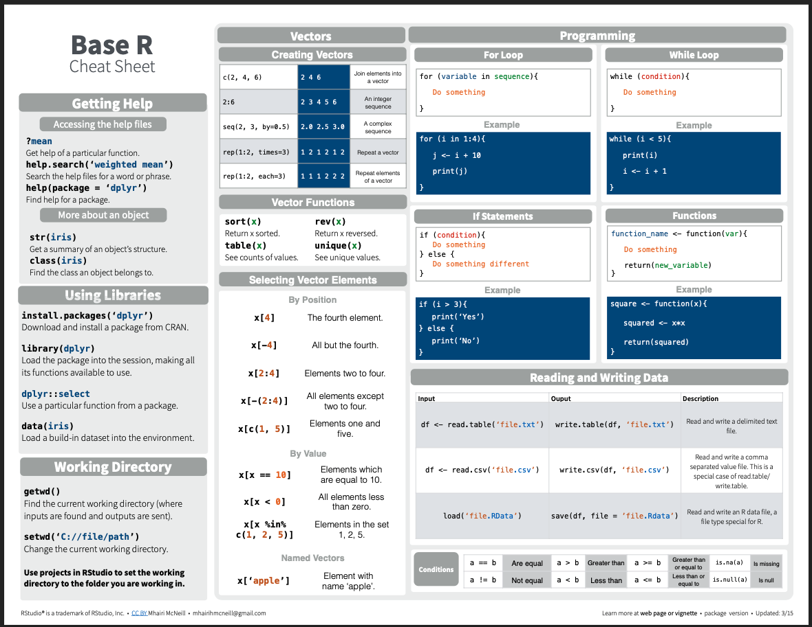

```{r setup, include=FALSE}
knitr::opts_chunk$set(echo = TRUE)
```

```{r echo=FALSE}

#  R Crash Course  
#      Author: Marissa A. Dyck             

#  Module 2: Base R

```
## Materials

### Scripts
You should have already downloaded the script for this module and save it to the scripts folder in your R labs folder.
If you missed this step do this now by right-clicking (or command-clicking for Macs) [here](mod_2_baseR.R).    

### Cheat sheets
You should also already have downloaded the cheat sheets in the prior module but if not here are the cheat sheets we will use in this module.

[Base R Cheat sheet](https://www.i3s.unice.fr/~malapert/R/pdf/base-r.pdf)        
[R reference card](https://cran.r-project.org/doc/contrib/Short-refcard.pdf)


## What is Base R
You may here people use the term **base R** when working in RStudio. This simply refers to the built-in functions and operations that R can perform without loading any **packages**. We will cover packages more later, but for now your [Base R Cheat sheet](https://iqss.github.io/dss-workshops/R/Rintro/base-r-cheat-sheet.pdf) will come in handy.


R Objects

## Objects
We have already covered that R can compute mathmatical equations, but what if we want to create an **object** and save it in R. Let's create our first **object**. **Objects** are defined using R's **assignment operator** (Windows shortcut: Alt + -)(Mac: Option + -), which looks like a left arrow (`<-`). 

### Creating objects
<span style="color: blue;">Type the following statement</span> directly into the **console**:

```

my_obj <- 6+11

```
Then hit "Enter". What does R return (e.g. look at the **console**)? 

NOTHING!

BUT.... check the **environment**. You should see that you now have a new **object** in your environment, called `myname`, and this object contains a single **text string**. Simply checking the **environment** works to view this simple object but for more complex objects you may want to print them in the console or open another window to view them.

### View objects
To print an object type the object name in either your **source** if you want it to print every time you run your code, or the **console** to just view it once.

To view an object you can type the function *View()* with your object name in the parentheses or click on the object in the **environment** window. 

<span style="color: blue;"> Print **and** view your object</span> using any of the methods described above.

NOTE: RStudio has a useful auto-fill feature, which can save you lots of time and headaches. After you've typed the first couple letters (e.g., "my"), RStudio will suggest "my_obj" (or use the "tab" key to trigger RStudio to give you autofill options) and you can just scroll to the right object/function and hit "Enter"! The auto-type feature, unlike R, is not case sensitive!  


In your blank script, let's define a new object. For example:

```{r results=F, echo = FALSE}

# create object my_name
my_name <- 'Marissa Dyck'  # use your name.

```

Now run that line of code. You should see a new **object** ('my_name') pop up in your **environment**.

Notice how for this **object** we put quotations `''` or `""` around the text. That is because words and letters are **characters** and not **numeric** variables so R recognized them differently.

<span style="color: blue;">Try creating the same object without the quotes</span>. What happens? You get an Error message right? This is because without the quotes R assumes you are referring to an **object** you have created called '*your name*' but it doesn't exits. We will cover data types more in a minute.

Of course, it's always a good idea to save your scripts often -- save this script in your 'scripts' folder using 'file' > 'save as' and title it <span style="color: blue;">'my_script_day1_1"</span>.

### Types of R objects
R has many different kinds of objects that you can define and store in memory. 

Objects that enable storage of information (data objects) include: **vectors**, **matrices**, **lists**, and **data frames**.

Objects that transform data and perform operations (e.g., statistics/visualizations) on data objects are called **functions**.


## Working with objects

### Load an existing script

Remember the file you downloaded at the beginning of this today's lab? That file is an R script (["mod_2_baseR.R"](mod_2_baseR.R)); Let's click back to it now.

### Functions

Functions are routines that take inputs (usually data objects) (also called **arguments**) and produce something useful in return (transformed data objects, summaries, plots, tables, statistics, files). 

In R, the name of the function is followed by parentheses, and any arguments (inputs) are entered inside the parentheses. The basic syntax looks like the code snippet below.

{width=25%}

```
## function syntax
functionName([argument 1, argument2, ...])
```

If you don't type the parenthesis, the function is not run- instead, the function definition is shown. 

Here are some examples of how functions are used. Note the parentheses!

```{r results = T}

# Functions ------------------- 

# sum
sum(1, 2, 3, 10)    # returns: 15

# combine
c(1, 2, 3, 10)   # combine four numbers into a single data object (a vector!)

# floor
floor(67.8)  # removes the decimal component of a number

# round
round(67.8)  # rounds a number

round    # oops, forgot the parentheses!

```

Remember, it's easy to get some help if you forget how a function works, <span style="color: blue;">Try accessing a help file for *round()*</span> using one of the methods we covered earlier. 

```{r class.source = 'fold-hide'}

?round        


```


### Data objects and variables

#### Data types

The basic data types in R are:

+ **numeric** (numbers)      
+ **character** (text strings)
+ **logical** (TRUE/FALSE)    
+ **factor** (categorical) 

Data of each of these types can be represented as **scalars**, **vectors**, **matrices**, **lists**, and **data frames** and various functions work differnetly or won't work at all depending on the data type provided

#### Scalars

Scalars are the simplest data objects. A scalar is just a single value of any data type.

```{r results=F}


#  Create R Objects ------------------------

  # Scalars----------------------

scalar1 <- 'this is a scalar'

scalar2 <- 104

```

Scalars can store information of any type. In the example above, `scalar1` is a character, `scalar2` is numeric. 

*If you're uncertain about the type of any R object the R function use the `typeof()` function.*

#### Vectors
**Vectors** are strings (single dimensional) of values (can be numbers or characters) which are created following the syntax below. Vectors can combine multiple scalars in a single data object. In fact, a scalar in R is really just a vector of length 1.

```{r results=T}
  # Vectors ----------------------

# create a vector of numbers 1 to 4
vector1 <- c(1, 2, 3, 4)  

# print vector1
vector1
```

In the code above we used a function called `c()`which is a '*combine*' **function**- it takes several smaller data objects and combines them together into a single object. We will be using this **function** a lot. 

There's a many different ways to create a  **vector**. Let's see some examples of ways we can create the same vector above more efficiently.
```{r results=T}

# create a vector of numbers 1 to 4 using ':'
vector2 <- 1:4  

# print vector2
vector2

# create a vector of numbers 1 to 4 using seq()
vector3 <- seq(1, 4, by = 1)

# print vector 3
vector3

# create a vector of numbers 1 to 4 using 'c'
vector4 <- c(1, 4)

# print vector 4
vector4
```

Notice, each **vector** is composed of one or more **scalar** elements of the same type. If you try to create a vector combining **numeric** and **character** elements you will get an error. You can try this in the **console** now.

Now let's do some stuff with vectors!

```{r results= T}

# make a vector of 1, 2, and 3
d1 <- 1:3  

d1
          
# add 3 to all elements of the vector d1
d2 <- d1 + 3  

d2

# elemntwise addition
d3 <- d1 + d2

d3

# check the number of elements in a vector
length(d1)           

# sum all the elements in a vector
sum(d3)              

# extract the second element in a vector
d2[2]                 

```


#### Matrices

**Matrix** data objects have two **dimensions**: rows and columns. All of the elements in a matrix must be of the same type. 

Let's make our first matrix. One simple way to make a matrix is just by joining two or more vectors using the function `cbind()` (bind vectors or matrices together by column) or `rbind()` (bind vectors or matrices together by row)

```{r}

  # Matrices ----------------------

# create a matrix by binding vectors, with vector d1 as column 1 and d2 as column 2
mymat <- cbind(d1, d2)

mymat

# confirm that the new object "mymat" is a matrix using the 'class()' function
class(mymat)   

 # create matrix another way (matrix constructor)
mymat <- matrix(
  c(1,2,3,4,5,6),
  nrow = 3,
  ncol = 2)  

mymat

```


We can do stuff with matrices too!

```{r}

# math with matrices

mymat + 2

sum(mymat)

# extract matrix elements

# extract the element in the 3rd row, 2nd column
mymat[3, 2]  

mymat[, 1]     # extract the entire first column

# Syntax for using []
# X[a,b]       access row a, column b element of matrix/data frame X
# X[,b]        access all rows of column b of matrix/data frame X
# X[a,]        access row a of matrix/data frame X

```

Notice, when using `[]` with vectors you only need one value to reference the element's position, however with matrices you need two values to specify the row (first) and the column (second).

#### Lists

**Lists** are more general than matrices. **List** objects are just a bunch of arbitrary R data objects (called **list elements**) grouped together into a single object! The elements of a list don't need to be the same length or the same type. The elements of a list can be **vectors**, **matrices**, other **lists**, or even **functions**.  

Let's make our first list:

```{r}

  # lists ----------------------

# create an empty list
mylist <- list()

# add elements to the empty list
mylist[[1]] <- c(1, 2, 3)     # note the double brackets- this is one way to reference list elements. 

mylist[[2]] <- c('piatra','craiului')

mylist[[3]] <- matrix(1:6,
                      nrow = 2)

# print mylist
mylist

# do stuff with lists

# extract the second list element
mylist[[2]]    

# extract the first row, second column from the matrix that is embedded as the third element in this list !
mylist[[3]][1,2]      

```

##### Data frames and tibbles

**Data frame** objects are the basic data storage object in R. Data frames are a special type of **list** in which each list element is a *vector* of equal length. Each list element in a data frame is also known as a *column*. 

Data frames superficially resemble matrices, since both have rows and columns. However, unlike matrices, the columns of a data frame can represent different data types (i.e., character, logical, numeric, factor), and can thereby represent different types of information!  

_Data frames are the fundamental data storage structure in R_. You can think of a data frame like a spreadsheet. Each row of the the data frame represents a different observation, and each column represents a different measurement taken on each observation unit. 

Let's make our first data frame. 

```{r}

  # Data frames ----------------------

 # create a data frame with two columns. Each column is a vector of length 3
df1 <- data.frame(col1 = c(1,2,3),
                  col2 = c("A","A","B")) 

df1

# extract the first element in the second column
df1[1, 2]    

# extract the second column by name (alternatively, df1[["col2"]])
df1$col2    

```

Now we have a data frame with three observation units and two measurements (variables).

A **tibble** is the same thing as a data frame, just with a few tweaks to make it work better in the **tidyverse**. We will primarily work with tibble data frames in this course. For our purposes right now, tibbles and data frames are the same thing.

## Making up data!

In this section, we will make up some fake data objects. In the module we'll practice working with real data! 

### Generating sequences of numbers

One task that comes up a lot is generating sequences of numbers:

```{r}

# Making up data ----------------------------------

# Generating vector sequences  

# sequential vector from 1 to 10
1:10            

# sequence of length 5 between 0 and 1 
seq(0, 1, length = 5)         

```

### Repeating sequences
Another task is to group regular recurring sequences together:

```{r}

# Repeating vector sequences 

# repeat 0 three times
rep(0, 
    times = 3) 

# repeat the vector 1:3 twice
rep(1:3, 
    times = 2) 

# repeat each element of 1:3 two times
rep(1:3, 
    each = 2)              

```

### Random number generator
We can also fill up a vector with random numbers using one of R's built in random number generators:

```{r}

# Random numbers 

# 10 samples from std. normal
rnorm(10)                    

# 10 samples from Normal(-2,4^2)
rnorm(10, 
      mean= -2, 
      sd = 4)      

# 5 samples from Binom(3,0.5)
rbinom(5,
       size = 3,
       prob = .5)  

# 5 samples from Binom(3,0.1)
rbinom(5, 3, .1)            

# 10 standard uniform random numbers
runif(10)  

  # 10 uniform random numbers from [-1,1]
runif(10,
      min = -1,
      max = 1)      

```

### Making fake data
And finally, we can make up a fake data frame (or tibble) using some of the tricks we just learned!

```{r}

# Make up an entire fake data frame!

my.data <- data.frame(
  Obs.Id = 1:100,
  Treatment = rep(c("A","B","C","D","E"),
                  each = 20),
  Block = rep(1:20,
              times = 5),
  Germination = rpois(100,
                      lambda = rep(c(1,5,4,7,1),
                                   each = 20)),   # random poisson variable
  AvgHeight = rnorm(100,
                    mean = rep(c(10,30,31,25,35,7),
                               each = 20))
)

my.data

# Use the "summary()" function to summarize each column in the data frame.
summary(my.data)   

# extract rows 21 to 30 and store as a new data frame
mydf = my.data[21:30, ]  

mydf

# access a column of the data frame by name
mydf$Treatment 

```

### R functions to explore data
Here are some useful R functions for exploring data **objects**. We will cover these in more depth later but take a look at the outputs for each now.

```{r eval=FALSE}

# Useful data exploration/checking tools in R --------------------

# Obtain length (# elements) of vector d2
length(d2)  

# Obtain dimensions of matrix or array
dim(mymat)

# summarize columns in a data frame. 
summary(my.data)

# look at the "internals" of an object (useful for making sense of complex objects!)
str(my.data) 

# get names of variables in a data frame (or names of elements in a named vector)
names(my.data) 

# get number of rows/observations in a data frame
nrow(my.data) 

# get number of columns/variables in a data frame
ncol(my.data)   
     

```


## Practice problems
Below are some exercises for your first stats assignment based on the material we just covered. For all exercises the results will be available on this website after I've graded the assignments. You have until the start of lab the following week to complete the practice problems for all modules we've covered. These are meant to test your knowledge of the material we've covered and help you learn to work with real data. These are meant to mimic working in R in the real world and you will have to modify code from the module and possibly learn to use a new function to complete these assignment. Remember you can always look up information for a particular **function** using `?function name`to open the **help** window. 

### 1 Create a vector
Create a vector called 'myvec' using any of the methods you learned with numbers 1 to 10. *Note there are multiple ways to do this*. 

```{r echo=FALSE}

# answer 1 (the most parsimonious)
myvec <- 1:10

# answer 2
myvec <- c(1, 10)

# answer 3 (time consuming)
myvec <- c(1, 2, 3, 4, 5, 6, 7, 8, 9, 10)

# answer 4 (unecessarily complicated for this exercise but works)
myvec <- seq(1, 10, by = 1)
```

### 2 Create a matrix with `rbind()`
Create a 3 row by 2 column matrix named 'mymat'. Use the `rbind()` **function** to bind the following three rows/vectors together:

```
c(1,4) 
c(2,5) 
c(3,6)
```

```{r echo=FALSE}

rbind(
c(1,4),
c(2,5),
c(3,6)
)

```

### 3 Extracting objects from data
Get the names of columns in the data frame you created earlier 'mydf'. *Hint see the R functions to explore data section*. Then extract all rows for column 5 by name, do the same thing using the element position e.g. `[]`
```{r echo=FALSE}

names(mydf)

mydf$AvgHeight

mydf[, 5]

```

### 4 Create a matrix
Create a new matrix called 'mymat2' that includes all the data from columns 3 to 5 of data frame mydf. *HINT: use the `as.matrix()` function to coerce a data frame into a matrix. Since we didn't cover this function you may need to look it up in the help files.*

> Note your values for some columns may be slighly different since the code to create mydf uses random number generators. 

```{r echo=FALSE}

as.matrix(mydf[, 3:5])

```


### 5 Create a list
Create a list named 'mylist' that is composed of a    
  - vector: 1:3,     
  - a matrix: matrix(1:6, nrow = 3, ncol = 2),      
  - and a data frame: data.frame(x =c (1, 2, 3), y = c(TRUE, FALSE, TRUE), z = c("a", "a", "b")).

```{r echo=FALSE}

#create an empty list
mylist <- list()

# add a vector of 1 to 3 to the list
mylist[[1]] <- 1:3

# add a matrix to the list
mylist[[2]] <- matrix(1:6,
                      nrow = 3,
                      ncol = 2)

# add a data frame to the list
mylist[[3]] <- data.frame(x = c(1, 2,3 ),
                          y = c(TRUE, FALSE, TRUE),
                          z = c("a", "a", "b"))

# print the list
mylist

```

### 6 Extracting objects from lists
Extract the second and third observation from the 1st column of the data frame in 'mylist' (the list created above). 

```{r echo=FALSE}

# call mylist then reference the position of the data frame in the list [[3]], then the column in the data frame [[1]], and finally the observations within that columns c(2, 3)
mylist[[3]][[1]][c(2, 3)]

```

### Submission
Please email me a copy of your R script for this assignment by start of lab on Friday January 26th with your first and last name followed by assignment 1 as the file name (e.g. 'marissa_dyck_assignment1.R')

> You should always be following best coding practices (see Intro to R module 1) but especially for assingment submissions. Please make sure each problem has its own header so that I can easily navigate to your answers and that your code is well organized with spaces as described in the best coding practices section and comments as needed. 

[--go to next module--](mod_3_data.html)


