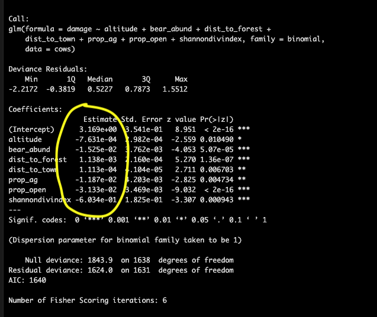

```{r setup, include=FALSE}
knitr::opts_chunk$set(
	echo = TRUE,
	message = FALSE,
	warning = FALSE,
	cache = TRUE
)
```

```{r echo = FALSE, message=FALSE, warning=FALSE}

#  ES482 R labs   
#      University of Victoria, Victoria BC Canada             

#  Statistical Modeling
# Module 1: Generalized linear models (GLMs)

# Libraries ----------------------

library(tidyverse)
library(PerformanceAnalytics)
library(lme4)
library(rphylopic)
library(MuMIn)
library(car)
library(AER)
library(broom)
library(pROC)

```

## Materials

### Scripts

1. Click [here](mod_2_glm.R) to download the script! Save the script to the 'scripts'' folder in your project directory you set up in the previous module.

2. Load your script in RStudio. To do this, open RStudio and click the **files** window and select the scripts folder and then this script.

### Cheat sheets

There are no cheat sheets specific to this module but don't forget the ones you've already printed for previous modules!

### Github repository

There is a Github repository that shows the full data formatting, statistical analysis, and graphics process for the publication associated with this data. For more information about the data check out the #README file.

[Github - Brown_bear_predation_RO](https://github.com/marissadyck/Brown_bear_predation_RO)

### Data

For this module we will work with the cows data from the brown bear conflict data set in Romania we worked with earlier. 

<span style="color: blue;"> Read in the cows data from the data/processed folder. <span style="color: blue;">

```{r class.source = 'fold-hide'}

# Data ----------------------

# Read in data for this module

cows <- read.csv('data/processed/cows.csv')

# check data structure
str(cows)

```

## Basics of a GLM

A Generalized liner model (GLM) is a variation on a linear regression which allows the response variable to have a distribution other than the normal (Gaussian) distribution.

### Steps of GLM

When applying a generalized linear model to your data follow the steps below    

1. Choose the most appropriate distribution for the response variable. e.g., Gaussian, Poisson, negative binomial, gamma, binomial, etc.   

2. Define the systematic component in terms of explanatory variables. 

3. Specify the link between the mean of the response variable and the systematic part.    

4. Check model assumptions (check for autocorrelation before running models).      

## Distributions
*Some* common non-normal distributions for wildlife data include...

### Binomial distribution

The **binomial distribution** represents the probability of an outcome given only two options (e.g. 0s and 1s). Presence/absence data from remote camera traps is a great example of this.


### Poisson distribution

The **poisson distribution** represents how many times an event is likely to occur over a specified period. Count data follow the poisson distribution.


### Negative binomial distribution

The negative binomial distribution is also used for count data but when the data are also over dispersed. We can check for dispersion using a **function** in R after we run our model.

### Which distribution to use?

Here is a helpful table from [Thiele and Markussen 2012](https://www.cabidigitallibrary.org/doi/abs/10.1079/PAVSNNR20127016) you can use to determine which distribution you should use with your data. 

{width=80%}


<span style="color: blue;"> Using some of the **functions** we covered in previous modules, take a look at the data and determine what distribution you would use given the response variable is *damage*. <span style="color: blue;">

```{r class.source = 'fold-hide'}

# look at full data
# View(cows) # this is commented out because rMarkdown won't run the View() function

# check out info on response variable
summary(cows$damage)


# plot the response variable
hist(cows$damage)

```

This histogram above should make it fairly clear that the **binomial distribution** would be a good fit for this data given the response variable contains 1s and 0s.

## Assumptions of GLM


### Independence

The data are independently distributed, i.e., cases are independent.

This assumption is checked in multiple ways. First, this is often related to how the data were collected, ensuring that each observation is unique and you do not have pseudo-replication in the data. Second, you need to check for autocorrelation between variables in your model. This can be done by running correlation test or plotting a correlation matrix with your explanatory variables.

### Homogeneity of variance

When you have categorical variables or groups within your data you need to check that the variance within groups is equal for all groups. This is commonly done with Levene's test (F test) which tests the null hypothesis that the variance is equal across groups. In order to not violate this assumption you want to result of this test to yield a p-value *GREATER* than 0.05.


### Normality of residuals

While the dependent variable does NOT need to be normally distributed, because it assumes a different distribution specified in the model (e.g. binomial, Poisson, etc.) the residuals should be normally distributed without a skew or kurtosis (long tail).

The normality of the residuals can be assessed via some tests, like the Shapiro-Wilk, or the Kolmogorov-Smirnov tests, but is often best assessed visually via a qq-plot. (Note that this assumption is generally the least important of the set; if it is not met, your beta estimates will still be unbiased, but your p-values will be inaccurate.)

### Influential observations

If you have a small data set or are concerned about outliers in your data. Assessing influence of individual observations may be useful. There are several ways to do this, first you can re-run your analysis without a particular data point and see how much your results and interpretation of said results changes; second, you can calculate Cook's distance which provides and estimate of the influence of a data point. 

> With the exception of autocorrelation, GLM model assumptions are checked after you have done your analysis.

## Run a GLM

### Test for autocorrelation

The cows data has already been checked, cleaned, and formatted for analysis using many of the tools and techniques we covered in the intro to R modules so we can jump right into exploring potential explanatory variables and checking the assumption of independence. 

First let's make a subset of the data that only includes explanatory variables we plan to use in models. <span style="color: blue;"> Using *dplyr* `select()` subset the cows data to only include the following columns and assign this object to the environment as *cows_cor* <span style="color: blue;">

- s.bear_abund    
- s.dist_to_forest    
- s.dist_to_town    
- openhab_10k   
- ag_10k    
- forest_10k    
- heteroag_10k    
- urban_10k   
- shdi_10k    

<span style="color: blue;"> Print the first few rows of data to make sure it worked <span style="color: blue;">

```{r class.source = 'fold-hide'}

# Autocorrelation test --------------------

# first let's make a subset of the data that only includes explanatory variables we plan to use in models we will assign this to the environment as cows_cor

cows_cor <- 
  cows %>% 
  select(bear_abund,
         s.dist_to_forest,
         s.dist_to_town,
         openhab_10k,
         ag_10k,
         heteroag_10k,
         forest_10k,
         urban_10k,
         shdi_10k)

# check that this worked by looking at the first few rows of data
head(cows_cor)
```

Now we will create a correlation chart using the *PerformanceAnalytics* package that provides a correlation coefficient (r2) values for pairwise combinations of variables.

When looking at this matrix the plots on the diagonal provide histograms (distribution of data) for each variable and the variable name. Above the diagonal are the correlation coefficients for each pairwise combination of variables, and below the diagonal are correlation plots for each pariwsie combination of variables.

```{r}

# correlation matrix - Pearson
chart.Correlation(cows_cor, 
                  histogram = TRUE, 
                  method = "pearson")

```

Do you notice anything about many of the relationships between variables? 

They are non-linear. Pearson's correlation coefficient assesses linear relationships between variables, and since these are non-linear our results are likely inaccurate. A better test to use would be Spearman's correlation coefficient. We can change the correlation coefficient that is computed in the `method = ` argument in the `chart.Correlation()` **function**. 

```{r}
# there are a number of non-linear relationships so we should use the Spearman method

# correlation matrix - Spearman
chart.Correlation(cows_cor, 
                  histogram = TRUE, 
                  method = "spearman")

```

> Based on these results we should not include the follow variables together in a model (r2 > 0.7)

- dist_to_town & forest_10k 
- dist_to_town & urban_10k    
- dist_to_forest & forest_10k   
- openhab_10k & heteroag_10k    
- ag_10k & forest_10k   


This process also serves as a great data check step. Do you notice anything else odd about the correlation matrix?

One of the r2 values is 1.00, this means that the data are perfectly correlated which should make you question this data as that happens if the data are exactly the same. Likely an error was made when extracting one of these variables in GIS and it was named as both variables. Luckily this isn't the final version if this data from our manuscript. I noticed this issue during the analysis and we re-extracted the landscape variables in GIS to correct the issue. A great example of why it's really important to look at your data again, and again, and again.... 


### Model syntax

The syntax for a GLM in the *lme4* package is as follows

```{r eval=FALSE}

# GLM syntax ----------------------

glm(response variable ~ explanatory variable 1 + explanatory variable 2,    
    data = your data,   
    family = chosen distribution)
    
```

Notice the code to run a GLM is relatively simple, yet data analysis can take a very long time. When running a GLM in R, the most time intensive steps are formatting, visualizing, and checking your data for errors. The code for a model itself is only a few lines and will run very quickly for most data sets. That is why we spent so much time covering data formatting/manipulation and visualization; if you can become more efficient at these steps it will greatly reduce the amount of time needed for an analysis, reduce errors, and ensure that you can trust the results of your analysis.

Let's run a global model (e.g., one with all non-correlated variables) with the Romania cows data. Remember *damage* is our response variable which we already determine fits with a **binomial distribution** so our family should be set ` family = binomial`, and we already tested for autocorrelation between our explanatory variables so we should ensure none of the variables that were highly correlated are in the same model.

```{r}

# GLM ----------------------

# run a global GLM which includes all variables not highly correlated
cows_global <- glm(damage ~ bear_abund + 
                     dist_to_forest + 
                     dist_to_town +
                     openhab_10k +
                     ag_10k + 
                     shdi_10k,
                   data = cows, 
                   family = binomial)

```


### Test Assumptions

Before interpreting any results from our model we need to check that our model meets the assumptions of a GLM that we covered earlier. 

#### Homogeneity of variance

We don't have any factor variables (groups) in our model so we wouldn't need to test this assumption but as an example we can set *year* as a factor and run Levene's test on a model that predicts *damage* as a function of *year* and interpret the result.
```{r}

# Test assumptions ----------------------

# Homogeneity of variance

cows <- cows %>% 
  
  # change year to a grouped variable (factor)
  mutate(year = as.factor(year))
  
  # run levene test
leveneTest(damage ~ year,
                   data = cows)

```

With Levene's test we are testing the null hypothesis that the groups have similar variance so we want a p > 0.05, but our value is 0.001 which would indicate we've violated this assumption. 

#### Dispersion

We should ensure that our data is not over dispersed or we would want to use the negative binomial distribution. We can do this with some manual calculations using information from the model summary. We want to calculate a chi square approximation of residual deviance which equals (residual deviance / degrees of freedom)

```{r}

# Dispersion

# test for over dispersion
summary(cows_global)

# calculate chi square approx. for residual deviance
1629/1613 # 1.0009 

# we want a value ~1 so our data is okay
# value >1 is over dispersed
# value <1 is under dispersed

```


## Interpreting model output

Printing the summary of our model gives us a lot of useful information but it can be overwhelming at first if you don't know what you are looking at so let's walk through it.

```{r}
# Results ----------------------

summary(cows_global)

```

The Call simply prints the model you've run so if you're scrolling through multiple outputs you know which one you are looking at and which variables were included in that model

{width=60%}

The coefficients provide information on direction and magnitude of effect for each variable in relation to your response variable. If the value is positive then that variable has a positive relationship with the response variable.

{width=60%}

### Odds ratios

To interpret the model coefficients we exponentiate them to get an **odds ratio** which represents the odds of an outcome occurring given a particular exposure (variable).The function for this is `exp()`

```{r}
# calculate odds ratio for coefficients
exp(coefficients(cows_global))

```

The interpretation for odds ratios is that odds ratios above 1 indicate a positive association and odds below 1 indicate a negative association, and the value of the exponentiated coefficient represents the change in odds of the response outcome given a unit increase in the explanatory variable. 

For values less than 1 you subtract them from 1 to get the percent change. For distance to town, the odds of bear predation (damage) to cows decreases by 1% for each meter increase in distance to town. 

1 - 0.99 = 0.01 * 100 = 1%

For positive values you calculate a percentage directly from the decimal of the odds ratio or you can subtract 1 from the odds ratio. So fo open habitat (10k) the odds of bear predation to cows increases by 73% for each increase in the proportion of open habitat within the surrounding 10km2 area. 

1.73 - 1 = 0.73 * 100 = 73%

### Scaling

One issue with interpreting odds ratios with our current model is we can't compare the relative importance of our variables that have different units. For example, is a 1% increase per increase of 1 bear (bear abundance) more or less than a 23% increase in proportion of agricultural habitat (ag_10k)?

To solve this issue we can **scale** the numeric variables in our data so that all our variables are unit-less and on the same scale. This allows us to calculate **effect sizes** and determine which variables have greatest influence.

To scale our data we can nest the `scale ()` **function** inside our model.

```{r}

# re-run scaled model

# scale variables inside the glm model to get effect sizes when looking at coefficients
cows_global <- glm(damage ~ scale(bear_abund) + 
                     scale(dist_to_forest) + 
                     scale(dist_to_town) +
                     
                     # the rest of the variables were already scaled when extracted in GIS
                     openhab_10k +
                     ag_10k + 
                     shdi_10k,
                   data = cows, 
                   family = binomial)

summary(cows_global)
```

When you look at the model summary output you'll notice the direction of effect (sign for the coefficient estimates -/+) and the p-values are the same, but the estimates themselves have changed, they all range between -1 and 1 now.

If we calculate odds ratios for the scaled coefficients we can now compare the magnitude of effect for different variables even though the original units of measurement were different.
```{r}

# calculate odds ratio for scaled coefficients
exp(coefficients(cows_global))

```

Now the interpretation is a bit less intuitive because we have to consider the probability of damage for each standard deviation increase in the explanatory variable rather than each unit increase, but we can tell that *bear_abund* has a greater effect size than *ag_10k* which we would not have been able to tell from the unscaled data.


### Plot odds ratios

Plotting the odds ratios for each covariate in the model can be a very helpful way to visualize the model results. 

The code below shows one way (myabe not the most elegant but it works) to extract the model coefficients and confidence intervals and put them into a data frame for plotting

```{r}

model_odds <- 
tidy(cows_global,
     exponentiate = TRUE,
     confint.int = TRUE) %>% 
  
  # bind the estiamtes with the confidence intervals from the model
  cbind(exp(confint(cows_global))) %>% 
  
  # change format to a tibble so works nicely with ggplot
  as.tibble() %>% 
  
  rename(lower = '2.5 %',
         upper = '97.5 %') %>% 
  
  filter(term != '(Intercept)')
```

Now let's use ggplot to make a nice graphic of these

```{r plot odds}
# specify data and mapping asesthetics
ggplot(data = model_odds,
       aes(x = term,
           y = estimate)) +
  
  # add points for the odss
  geom_point() +
  
  # add errorbars for the confidence intervals
  geom_errorbar(aes(ymin = lower,
                    ymax = upper),
                linewidth = 0.5,
                width = 0.4) +
  
  geom_hline(yintercept = 1,
             alpha = 0.5) +
  
  # rename the x axis labels
  scale_x_discrete(labels = c('Agriculture',
                              'Opoen habitat',
                              'Bear abundance',
                              'Distance to forest',
                              'Distance to town',
                              'SHDI')) +
  
  # rename y axis title
  ylab('Odds ratio') +
  
  # flip x and y axis 
      coord_flip() +

  # specify theme
  theme_bw() +
  
  # specify theme elements
  theme(panel.grid = element_blank(),
        axis.title.y = element_blank())
```


### Predicted probabilities

Recall, that when we choose a distribution to use with our GLM we also select a link function which maps the nonlinear relationship so that the linear model can be fit. This transformation is applied to the expected values so we have to use the proper inverse function to get predicted probabilities based on our model. Since we used a **binomial distribution** which uses the logit link function or log odds transformation, to get probabilities from our model we need to apply the *inverse logit* function. The **function** for this in R is `plogis()`.

```{r}

# inverse logit of coefficients to get probabilities 
plogis(coefficients(cows_global))

```

The `predict()` **function** is a more efficient way to get predicted probabilities from you model. With this **function** we can generate a new data frame that shows the relationship between our explanatory variables and predicted probabilities of our response variable to graph for easier interpretation. 

First we need to create a new data frame to add the predicted probabilities to. For each graph we want to generate we have to select one explanatory variable to plot (x-axis) which we will create set of values for that range from the minimum to the maximum value in our original data. The other variables are held constant at the mean to allow for accurate graphing and depiction of the relationship between the variable of interest and the response (predicted probability of our response)
```{r}

# Newdata ----------------------

# first create a new data frame that includes all variables in the model (spelled EXACTLY the same) and where one variable (the one we want to graph) has a range from the min to max value in our data and the other variables are held constant at the mean value from the data.

# let's start with bear abundance
new_data_bear <- expand.grid(bear_abund = seq(min(cows$bear_abund), 
                                              max(cows$bear_abund),
                                              by = 0.1),
                             dist_to_forest = mean(cows$dist_to_forest),
                             dist_to_town = mean(cows$dist_to_town),
                             openhab_10k = mean(cows$openhab_10k),
                             ag_10k = mean(cows$ag_10k),
                             shdi_10k = mean(cows$shdi_10k))

# look at what we created
head(new_data_bear)
```
If you examine the new data frame we created you will see that bear abundance is the only variable that changes in value and it increase by 0.1 which is what we set in the `seq ()` **function** above. 

Now we can add predicted probabilities to this new data frame using the `predict()` **function**. To do this we need to assign an object to the environment that provides a column (pred) in our new data frame (new_data_bear) where we can fill the predicted probabilities
```{r}

# use predict function to get predicted probabilities of cow damage based on our model
new_data_bear$pred <- predict(cows_global,
                              type = 'response',
                              newdata = new_data_bear)

head(new_data_bear)
```

With a little more coding and finagling of the data we can also get the standard error of the predicted values to include in our graph.
```{r}
# use predict function to get predicted probabilities of cow damage based on our model
new_data_bear_pred <- predict(cows_global,
                              type = 'response',
                              se.fit = TRUE,
                              newdata = new_data_bear)

head(new_data_bear_pred)

new_data_bear_pred <- cbind(new_data_bear,
                            new_data_bear_pred) %>% 
  
  # add column for lower and upper 95% CI using manual calculation from SE
  mutate(lwr = fit - (1.96*se.fit),
         upr = fit + (1.96*se.fit))

head(new_data_bear_pred)


```
If we examine the new data frame again we can see there is an additional column of data at the end called pred which our the predicted probabilities from our model given each value for bear abundance and the mean values for all other variables. 

> Be careful when creating your new data frame if you don't include all the variables in your model or spell a variable wrong when you go to use the predict funciton it will give you an error. Let's go through a quick example of this so you know what to expect. 

```{r}

# generate new data with typo
new_data_bear_typo <- expand.grid(bear_abund = seq(min(cows$bear_abund), 
                                              max(cows$bear_abund),
                                              by = 0.1),
                             dist_to_forest = mean(cows$dist_to_forest),
                             dist_to_town = mean(cows$dist_to_town),
                             open_hab10k = mean(cows$openhab_10k),
                             ag_10k = mean(cows$ag_10k),
                             shdi_10k = mean(cows$shdi_10k))

# look at what we created
head(new_data_bear_typo)
```

Now try to add the predicted probabilities to your new data, what happens?
```{r eval=FALSE}
# add predicted probabilities to new data with typo
new_data_bear_typo$pred <- predict(cows_global,
                              type = 'response',
                              newdata = new_data_bear_typo)
```
You get this error    

"Error in eval(predvars, data, env) : object 'openhab_10k' not found'   

If this happens while you are coding your first reaction should be to check your data, R says it can't find openhab_10k so may sure your new data frame includes that variable which we did, but it was spelled incorrectly the '_' was before 'hab' instead of after. A simple fix but new R users often get tripped up by errors because they immediately freak out, instead read the error, make sure you understand what the issue is, and go back to the previous step in your code to see if you can fix the mistake.

This is also why it's important to keep your code clean, code in steps, and check your progress as you go rather than trying to type everything out and run a bunch of code at once, it's much harder to find an error then.

### Graph predictions

Now that we have predicted probabilities from our model for one of our variables we can graph these predictions to aid in interpreting and conveying our results.

```{r}

# Graphs ----------------------

# create graph with predicted prob x bear abundance
ggplot(data = new_data_bear_pred, aes(x = bear_abund, y = fit)) +
  
  # add line for predicted prob
  geom_line() +
  
  # add error bar
  geom_ribbon(aes(ymin = lwr,
                  ymax = upr),
              alpha = 0.5) # changes opacity so you can see the main line
```

Now we have a graphical representation of the relationship between bear abundance and the probability of bear predation on cows.

For practice, make this graph look nicer by   

<span style="color: blue;">
- add raw data to plot
- making more informative axis labels   
- expanding the y-axis from 0 to 1    
- adding ticks on the x-axis at intervals of 10   
- removing the grey background 
- add border to graph   
- remove spacing between plot and border    
- adding a cow silhouette on the bottom right <span style="color: blue;">

```{r class.source = 'fold-hide'}

# save phylopic image for cows
cows_phylopic <- get_phylopic("cba95817-8806-49c2-932c-fb69a644c53d")

# create graph with predicted prob x bear abundance
ggplot(data = new_data_bear_pred, aes(x = bear_abund, y = fit)) +
  
  # add line for predicted prob
  geom_line() +
  
  # add error bar
  geom_ribbon(aes(ymin = lwr,
                  ymax = upr),
              alpha = 0.5) + # changes opacity so you can see the main line 
  
  # add raw data points
  geom_jitter(data = cows,
             aes(x = bear_abund,
                 y = damage),
             shape = 16,
             size = 1.5,
             width = 1,
             height = 0.05,
             alpha = 0.5) + # make points opaque so can see overlapping points
  
  # change axis labels
  labs(x = 'Relative bear abundance',
       y = 'Predicted probability of bear preadtion') +
  
  # expand y axis
  coord_cartesian(ylim = c(0, 1)) +
  
  # add ticks for x axis at 10
  scale_x_continuous(breaks = seq(0, 80, 10),
                     
                     # expand removes spacing between plot and border
                     expand = c(0,0)) +
  
  # remove grey background and add border
  theme(panel.background = element_blank(),
        panel.border = element_rect(fill = NA),
        axis.title = element_text(size = 12)) +
  
  # add cow image
  add_phylopic(cows_phylopic, 
               alpha = 1,
               ysize = 0.1,
               x = 73,
               y = 0.98)
```

## Model selection

More than likely we will not be running one single model for our data but rather we will run several models that represent different hypotheses and we will compare them to find the model that fits the data best and explains the most variation and then we will interpret and present the results of this model.

Let's run several models for the cows data including a global model (e.g., the one we just ran which includes all variables that are not highly correlated) and a null model (used to ensure data are actually describing more variation than if no data were included)

```{r}

# Model selection ----------------------

# models for model selection

# we already ran cows_global but here is code again
cows_global <- glm(damage ~ scale(bear_abund) + 
                     scale(dist_to_forest) + 
                     scale(dist_to_town) +
                     openhab_10k +
                     ag_10k + 
                     shdi_10k,
                   data = cows, 
                   family = binomial)

# null
cows_null <- glm(damage ~ 1,
                 data = cows,
                 family = binomial)

# bears and broad landscape model
cows_1 <- glm(damage ~ scale(bear_abund) +
                openhab_10k +
                ag_10k +
                shdi_10k,
              data = cows, 
              family = binomial)

# bears + proximity of grazing cattle to bear habitat
cows_2 <- glm(damage ~ scale(bear_abund) + 
                scale(dist_to_forest) +
                openhab_10k,
              data = cows, 
              family = binomial)

# bears + proximity of grazing cattle to human protection
cows_3 <- glm(damage ~ scale(bear_abund) + 
                scale(dist_to_town),
              data = cows, 
              family = binomial)

# bears + proximity to bears and humans and habitat needs for cows and bears
cows_4 <- glm(damage ~ scale(bear_abund) + 
                scale(dist_to_town) +
                scale(dist_to_forest) +
                openhab_10k +
                ag_10k,
              data = cows, 
              family = binomial)


```

Now that we have run a few models to compare we can use the `model.sel()` **function** in the *MuMIn* package to generate a model selection table

```{r}
# compare models with model.sel
model.sel(cows_global,
          cows_null,
          cows_1,
          cows_2,
          cows_3,
          cows_4)
```

When comparing models we want to focus on the last 4 columns (LogLik, AICc, delta, and weight)

#### Log likelihood

The likelihood function tells us the relative probability (range - infinity to + infinity) that the given variables in our model generated the data we provided. The higher the log likelihood the better the model fits the data set. There is no standard log likelihood value that indicates a good model fit rather these values are used to compare across models from the same data set, and are used to compute AIC scores.

#### AICc

Akaike Information Criterion corrected for small sample size or AICc is a mathematical method for evaluating how well a model fits the data it was generated from. AICc is used to compare models and determine which is the best fit to the data with the lowest score representing the best fit. AICc scores are based of the maximum likelhood estimate and the number of variables in the model. Since the more things you add to a model the more likely you are to explain additional variation in the data, AICc penalizes a model for each additional variable, so if a variable isn't explaining enough variation in the data the AICc score for that model shouldn't decrease much when that variable is added to the model. 

#### Delta AICc

Delta AICc represents the difference between the top model and each following model in the model selection table. Generally a rule-of-thumb is if a model has a delta AICc less than 2 from the top model those models are considered to perform the same. 

#### Weight

The AICc weight represents the relatively likelihood of a model compared to all other models in the in the table where a value of 1.0 = the most likely. 

For our model comparison we have a clear top model that is well above 2 AICc better than all the other models and is the most likely with a weight of 1.0.


## Model validation/fit

One final step in the process is to make sure you have a well-fit model, so not just a model that outperformed the others in your model set but one that actually fits the data well and describes a decent amount of the variance. 

We've already done one step of this process, which was including a null model in our model set and ensuring that our chosen model performs better than a null.

### Plot model

A first initial step after you have chosen your model, is usually to plot your model using the `plot()` function.

> However, it's important to note though that R does not have a distinct `plot.glm()` function, when you run the `plot()` function it calls `plot.lm` which is appropriate for linear models and not necessarily non-linear models, which is what we've modeled here using `glm()`. If you want to learn more about interpreting these plots, check out a great response by @gung on [StackExchange](https://stats.stackexchange.com/questions/121490/interpretation-of-plot-glm-model)    


Let's run the `plot()` function of our top model, which will return 4 plots by default to illustrate this with the cows data.

What we are looking for is in the first plot the residuals vs leverage, that there aren't huge deviations at either tail of the plot which would indicate with a glm that the relationship may not be linear or logistic but quadratic and you would want to include a quadratic term for one or more variable in your model. 

```{r plot model}

# plot chosen model
plot(cows_global)

```


### Area under the curve

For a **binomial** glm we can assess the Area under Curve or Receiver operating characteristic (ROC) curve is used to evaluate the performance. It measures how wel the model is able to distinguish between the two classifications of the model. 

```{r auc}

c.roccurve <- roc(cows$damage, 
                  predict(cows_global, type = 'response'))

auc(c.roccurve)

plot.roc(c.roccurve, main="Area Under the Curve for best model")
```


### R squared

You can also calculate a pseudo R squared value for your model which indicates how much of the variance is explained by the covariates in your model.

To do this we use the null and residual deviance values in the model summary
```{r r square}

summary(cows_global)

# 1 - (Residual Deviance/Null Deviance)

1 - (1629/1822) # you want a high r square so this is not a very good fitting model
```


## Assignment and next module

[--assignment 4](assign_4.html)   


[--go to next module--](mod_3_glmm.html)