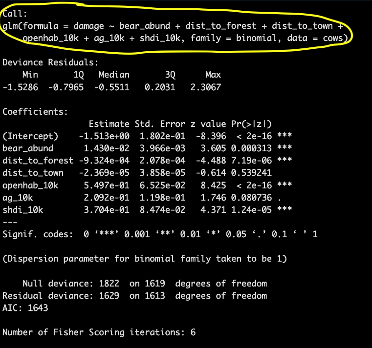

```{r setup, include=FALSE}
knitr::opts_chunk$set(
	echo = TRUE,
	message = FALSE,
	warning = FALSE,
	cache = TRUE
)
```

```{r echo = FALSE, message=FALSE, warning=FALSE}

#  ES482 R labs   
#      University of Victoria, Victoria BC Canada             

#  Statistical Modeling
# Module 2: Generalized linear models (GLMs)

# Libraries ----------------------

library(tidyverse) # for data cleaning and tidying operations
library(PerformanceAnalytics) # for generating correlation plots
library(lme4) # fitting glms
library(rphylopic) # adding silhouettes to graphs
library(MuMIn) # model selection
library(car)
library(AER) # testing for dispersion w/ poisson distribution
library(broom)
library(pROC) # calculating area under the curve
library(ResourceSelection) # Package with function to test dispersion for 
library(ggeffects) # getting model predictions in tibble format for plotting

```

# Materials

## Scripts

1. Click [here](mod_2_glm.R) to download the script! Save the script to the 'scripts'' folder in your project directory you set up in the previous module.

2. Load your script in RStudio. To do this, open RStudio and click the **files** window and select the scripts folder and then this script.

## Cheat sheets

There are no cheat sheets specific to this module but don't forget the ones you've already printed for previous modules!

## Github repository

There is a Github repository that shows the full data formatting, statistical analysis, and graphics process for the publication associated with this data. For more information about the data check out the #README file.

[Github - Brown_bear_predation_RO](https://github.com/marissadyck/Brown_bear_predation_RO)

## Data

For this module we will work with the cows data from the brown bear conflict data set which should be in the data/raw folder

<span style="color: blue;"> Read in the cows data from the data/raw folder and in the same code chunk set the column names to lowercase. And then take a look at the structure of the data; you'll want to go back and edit your code to specify the data types for some variables if they aren't reading in properly <span style="color: blue;">

You can check out this [README file from the Githup repository](data/README.html) to learn more about the data, the data you are working with is *slightly* different from the data in this repository but this will give you a general understanding of the variables and practice with reading/interpreting information from a README file.

```{r class.source = 'fold-hide'}

# Data ----------------------


# INSERT YOUR CODE HERE ----------------------
# Read in data for this module

cows <- read_csv('data/raw/cows.csv',
                 
                 col_types = cols(Damage = col_factor(),
                                  Year = col_factor(),
                                  Month = col_factor(),
                                  Targetspp = col_factor(),
                                  Hunting = col_factor(),
                                  .default = col_number())) %>% 
  
  rename_with(tolower)

# check data structure
str(cows)

```

## Basics of a GLM

A Generalized liner model (GLM) is a variation on a linear regression which allows the response variable to have a distribution other than the normal (Gaussian) distribution. This is useful because one of the main assumptions of a linear regression is that the response variable is normally distributed, but ecological data often violates this assumption which can lead to unreliable model estimates. 

### Steps of GLM

When applying a generalized linear model to your data follow the steps below    

1. Choose the most appropriate distribution for the response variable. e.g., Gaussian, Poisson, negative binomial, gamma, binomial, etc.   

2. Define the systematic component in terms of explanatory variables (write out your model!). 

3. Specify the link between the mean of the response variable and the systematic part.    

4. Check model assumptions (check for multicolinearity before running models).      

# Distributions
*Some* common non-normal distributions for wildlife data include...

## Binomial distribution

The **binomial distribution** represents the probability of an outcome given only two options (e.g. 0s and 1s). Presence/absence data from remote camera traps is a great example of this.


## Poisson distribution

The **poisson distribution** represents how many times an event is likely to occur over a specified period. Count data follow the poisson distribution.


## Negative binomial distribution

The negative binomial distribution is also used for count data but when the data are also over dispersed. We can check for dispersion using a **function** in R after we run our model.

## Which distribution to use?

Here is a helpful table from [Thiele and Markussen 2012](https://www.cabidigitallibrary.org/doi/abs/10.1079/PAVSNNR20127016) you can use to determine which distribution you should use with your data. 

{width=80%}


<span style="color: blue;"> Using some of the **functions** we covered in previous modules, take a look at the data and determine what distribution would you use given the response variable is *damage*. <span style="color: blue;">

```{r class.source = 'fold-hide'}

# look at full data
# View(cows) # this is commented out because rMarkdown won't run the View() function

# check out info on response variable
summary(cows$damage)

```

We can also plot the data to look at this.

Normally I would use the histogram function `hist()` to do this but... <span style="color: blue;">try it and see what happens </span> remember you can use ?hist() to look up the R documentation if you aren't familiar with this function yet. 

```{r, echo=FALSE, eval=FALSE}
hist(cows$damage)
```
Since this variable is a factor we can visualize it with the `plot()` function instead

```{r}
plot(cows$damage)
```

This histogram above should make it fairly clear that the **binomial distribution** would be a good fit for this data given the response variable contains 1s and 0s (a binary response).

# Assumptions of GLM

While we don't have to worry about the assumption of normality for our response variable there are still several important assumptions of a glm that can lead to unreliable model estimates if violated. 

## Independence

The data are independently distributed, i.e., cases are independent.

This assumption is checked in multiple ways. First, this is often related to how the data were collected, ensuring that each observation is unique and you do not have pseudo-replication in the data. Second, you need to check for multicolinearity between variables in your model. This can be done by running correlation tests or plotting a correlation matrix with your explanatory variables. It is also checked after you've fit a model by calculating Variance Inflation Factor (VIF).  

## Homogeneity of variance

When you have categorical variables or groups within your data you need to check that the variance within groups is equal for all groups. This is commonly done with Levene's test (F test) which tests the null hypothesis that the variance is equal across groups. In order to not violate this assumption you want to result of this test to yield a p-value *GREATER* than 0.05.


## Normality of residuals

While the dependent variable does NOT need to be normally distributed, because it assumes a different distribution specified in the model (e.g. binomial, Poisson, etc.) the residuals should be normally distributed without a skew or kurtosis (long tail).

The normality of the residuals can be assessed via some tests, like the Shapiro-Wilk, or the Kolmogorov-Smirnov tests, but is often best assessed visually via a qq-plot. (Note that this assumption is generally the least important of the set; if it is not met, your beta estimates will still be unbiased, but your p-values will be inaccurate, and as we've covered in this class we shouldn't rely on p-values as our only or primary indicator of variable importance).

## Influential observations

If you have a small data set or are concerned about outliers in your data. Assessing influence of individual observations may be useful. There are several ways to do this, first you can re-run your analysis without a particular data point and see how much your results and interpretation of said results changes; second, you can calculate Cook's distance which provides and estimate of the influence of a data point. 

> With the exception of multicolinearity, GLM model assumptions are generally checked after you have done your analysis (e.g. fit your model).


# Before fitting a model

First before we fit a model we want to test for correlation between our explanatory variables.

## Test for multicolinearity

The cows data has already been checked, cleaned, and formatted for analysis using many of the tools and techniques we covered in the intro to R modules so we can jump right into exploring potential explanatory variables and checking the assumption of independence. 

First let's make a subset of the data that only includes **Numeric** explanatory variables we plan to use in models (this is because we can't quantify correlation between non-numeric and numeric variables). <span style="color: blue;"> Using *dplyr* `select()` subset the cows data to only include the following columns and assign this object to the environment as *cows_cor* <span style="color: blue;">

- altitude  
- human_population  
- bear_abund    
- dist_to_forest    
- dist_to_town    
- prop_ag 
- prop_gras 
- prop_open 
- prop_forest


<span style="color: blue;"> Print the first few rows of data to make sure it worked <span style="color: blue;">

```{r class.source = 'fold-hide'}

# multicolinearity test --------------------

# first let's make a subset of the data that only includes explanatory variables we plan to use in models we will assign this to the environment as cows_cor

# INSERT YOUR CODE HERE --------------------
cows_cor <- 
  cows %>% 
  select(bear_abund,
         altitude,
         human_population,
         dist_to_forest,
         dist_to_town,
         shannondivindex,
         prop_ag,
         prop_gras,
         prop_open,
         prop_forest)

# check that this worked by looking at the first few rows of data
head(cows_cor)
```

Now we will create a correlation chart using the *PerformanceAnalytics* package that provides a correlation coefficient (r2) values for pairwise combinations of variables.

When looking at this matrix the plots on the diagonal provide histograms (distribution of data) for each variable and the variable name. Above the diagonal are the correlation coefficients for each pairwise combination of variables, and below the diagonal are correlation plots for each pariwsie combination of variables.

```{r}

# correlation matrix - Pearson
chart.Correlation(cows_cor, 
                  histogram = TRUE, 
                  method = "pearson")

```

Do you notice anything about many of the relationships between variables? 

Many of them are non-linear. Pearson's correlation coefficient assesses linear relationships between variables, and since these are non-linear our results are likely inaccurate. A better test to use would be Spearman's correlation coefficient. We can change the correlation coefficient that is computed in the `method = ` argument in the `chart.Correlation()` **function**. 

```{r}
# there are a number of non-linear relationships so we should use the Spearman method

# correlation matrix - Spearman
chart.Correlation(cows_cor, 
                  histogram = TRUE, 
                  method = "spearman")

```

> Based on these results we should not include the follow variables together in a model (r2 > 0.7)

- dist_to_town & prop_forest   
- prop_ag & prop_forest 
- prop_gras & prop_open 


> And we might be cautious including (r2 > 0.6)

- dist_to_forest & prop_ag
- human_population & dist_to_town 


> Important note, this doesn't mean you can't use both variables in your analysis, but you can't include them in the same **model**, so if you are interested in the effects of both distance to town and proportion of forest you can evaluate both by including them in separate models and comparing which model fits the data best. We will cover this more when we get to model selection  

This process also serves as a great data check step. Do you notice anything else odd about the correlation matrix?

One of the r2 values is 1.00, this means that the data are perfectly correlated which should make you question this data as that happens only if the data are **exactly** the same. Likely an error was made when extracting one of these variables in GIS and it was named as both variables. Luckily this isn't the final version if this data from our manuscript. I noticed this issue during the analysis and we re-extracted the landscape variables in GIS to correct the issue. A great example of why it's really important to look at your data again, and again, and again.... 

## Explore explanatory variables

In addition to plotting your response variable to determine what distribution you should use, you should always do some data exploration of your explanatory variables as well. This is an important step that is often overlooked until you are having issues with your model estimates/fit and if you take the time to do it prior to fitting your model it can save a a lot of time and headache.

The main thing you are looking for is that you have enough non-zero observations of each variable and enough diversity (range of values) that this variable will actually be pertinent to include as a model predictor

*Note these will print twice for each variable because I've provided two possible ways to code this*

```{r}
# histograms of explanatory variables --------------------

hist(cows$altitude)
hist(cows$human_population)
hist(cows$bear_abund)
hist(cows$dist_to_forest)
hist(cows$dist_to_town)
hist(cows$shannondivindex)
hist(cows$prop_forest)
hist(cows$prop_ag)
hist(cows$prop_open)

# or using purrr and the cows.cor data

cows_cor %>% 
  
  # use imap which will retain both the data (x) and the variable names (y)
  imap(~.x %>% 
        
         # use the hist function on the data from previous pipe
        hist(.,
             
             # set the main title to y (each variable)
             main = .y))

```

You'll notice from these plots that there are a lot of zeros/very small values for the human population variable so we may want to avoid using that one. There is no real cutoff for what is too many zeros/too little variation in the data. This is up to each person to decide which is why it's important to be familiar with your data and to plot this to check. However, if you do find your modeling is returning large std error or not fitting properly and you have a variable that is on the cusp of having too little data, try removing it and see if the model fits better. 

Trial and error is the name of the game with much of statistical modeling.

# Fit a GLM


## Model syntax 

The syntax for a GLM in the *lme4* package is as follows (not there are multiple packages you can use to fit a glm but this is a commonly used one in our field).

```{r eval=FALSE}

# GLM syntax ----------------------

glm(response variable ~ explanatory variable 1 + explanatory variable 2,    
    data = your data,   
    family = chosen distribution)
    
```

Notice the code to run a GLM is relatively simple, yet data analysis can take a very long time. When running a GLM in R, the most time intensive steps are formatting, visualizing, and checking your data for errors. The code for a model itself is only a few lines and will run very quickly for most data sets. That is why we spent so much time covering data formatting/manipulation and visualization; if you can become more efficient at these steps it will greatly reduce the amount of time needed for an analysis, reduce errors, and ensure that you can trust the results of your analysis.


## Fitting a model 

Let's run a global model (e.g., one with all non-correlated variables) with the Romania cows data. Remember *damage* is our response variable which we already determine fits with a **binomial distribution** so our family should be set ` family = binomial`, and we already tested for multicolinearity between our explanatory variables so we should ensure none of the variables that were highly correlated are in the same model.

```{r}

# GLM ----------------------

# run a global GLM which includes all variables not highly correlated
cows_global <- glm(damage ~ altitude +
                     bear_abund + 
                     dist_to_forest + 
                     dist_to_town +
                     prop_ag +
                     prop_open +
                     shannondivindex,
                   data = cows, 
                   family = binomial)

```


## Test Assumptions

Before interpreting any results from our model we need to check that our model meets the assumptions of a GLM that we covered earlier. 

### Model summary

Although this won't indicate if you've violated any specific assumptions, running the `summary()` of your model can be a quick way to gauge if anything is wonky. If you are getting crazy big standard errors or a warning message it may be worth 

```{r}

summary(cows_global)
```


### Multicolinearity

We checked for colinearity between our variables before fitting our model, but because any deviation from 0 technically implies colinearity and violates this assumption we've used a somewhat arbitraty cutoff of 0.6 or 0.7 (depending on the person/journal) so to ensure our final model doesn't violate this assumption we calculate the Variance Inflation Factor (VIF) of each variable in our models where a value of 1 indicates no correlation between that variable and other predictors in our model, VIF 1-5 is generally acceptable for ecological data, VIF >5 is considered problematic. 

Here's a few lines of code that calculate and print VIF for our model AND display it graphically

Calculating and printing VIF
```{r}
# VIF ----------------------

# report VIF
vif(cows_global)
```


Plots of each variable with ggplot

```{r}

# additional plot of each variable
# calculate vif
vif(cows_global) %>%
  
  # Converts the named vector returned by vif() into a tidy tibble
  enframe(name = 'Predictor', 
          value = 'VIF') %>%
  
  # plot with ggplot
  ggplot(aes(x = reorder(Predictor, VIF), # reorders from smallest VIF to largest (not sure I want like this)
             y = VIF)) +
  
  # plot as bars
  geom_bar(stat = 'identity', fill = 'skyblue') +
  
  # add labels
  labs(x = 'Predictor',
       y = 'VIF') +
  
  # set theme
  theme_classic()
```


### Dispersion

We should ensure that our data is not over dispersed or we would want to use the negative binomial distribution. We can do this with some manual calculations using information from the model summary. We want to calculate a chi square approximation of residual deviance which equals (residual deviance / degrees of freedom)

```{r}

# Dispersion

# test for over dispersion
summary(cows_global)

# calculate chi square approx. for residual deviance
1624/1631 # 0.99

# we want a value ~1 so our data is okay
# value >1 is over dispersed
# value <1 is under dispersed

```

You can also use several packages to do this based on the distribution of your response variable


For our model (binomial) we can use the Hosmer-Lemeshow test in the *ResourceSelection* package

```{r}
hoslem.test(cows$damage, fitted(cows_global))
```


If you have a poisson distribution you can also use a function from the *AER* package if you have a poisson 

```{r eval=FALSE}
dispersiontest(cows_global)
```

### Model plots

Another approach you will see to check for model fit/violation of assumptions is to look at the residuals from your model using the plot(model) function which returns 4 standard plots. These are most often used to assess model fit and violations of model assumptions for data which are **normally distributed** e.g. linear regression NOT Generalized linear models, but some plots can be informative for glms as well. 
```{r}

plot(cows_global)
```
Here is a good overview from [stackExchange](https://stats.stackexchange.com/questions/121490/interpretation-of-plot-glm-model/139624#139624) that summarizes what you might be looking for in these plots with non-normal data (e.e.g poisson, binomial, negative binomial etc.)

* The Residuals vs Fitted plot can help you see, for example, if there are curvilinear trends that you missed. But the fit of a logistic regression is curvilinear by nature, so you can have odd looking trends in the residuals with nothing amiss.  

* The Normal Q-Q plot helps you detect if your residuals are normally distributed. But the deviance residuals don't have to be normally distributed for the model to be valid, so the normality / non-normality of the residuals doesn't necessarily tell you anything. 

* The Scale-Location plot can help you identify heteroscedasticity. But logistic regression models are pretty much heteroscedastic by nature. 

* The Residuals vs Leverage can help you identify possible outliers. But outliers in logistic regression don't necessarily manifest in the same way as in linear regression, so this plot may or may not be helpful in identifying them. 


# Interpreting model output

Printing the summary of our model gives us a lot of useful information but it can be overwhelming at first if you don't know what you are looking at so let's walk through it.

```{r}
# Results ----------------------

summary(cows_global)

```

The Call simply prints the model you've run so if you're scrolling through multiple outputs you know which one you are looking at and which variables were included in that model

{width=60%}

The coefficients provide information on direction and magnitude of effect for each variable in relation to your response variable. If the value is positive then that variable has a positive relationship with the response variable.

{width=60%}
The p-value indicates statistical significance of an explanatory variable where generally p<0.05 indicates a significant predictor, but remember we are moving away from significance testing because p-values can be inaccurate and biased easily. Recall from papers you read in class the a larger sample size (n) is more likely to yield a significant p-value based on the equation used to calculate p. Also ANY violations of the model assumptions (no matter how minor) can influence the p-values and as much as we try to avoid violating assumptions we will never have truly independent variables (e.g. r2 = 0) so we will always violate this assumption to some degree.


The information printed at the bottom relates to model fit. 

{width=60%}
In mathematical terms:

Null deviance = 2(loglikelihood(Saturated model)) - 2(loglikelihood(Null model)) on degrees of freedom = (df saturated - df null)

Residual deviance = 2(loglikelihood(Saturated model)) - 2(loglikelihood(Proposed model)) on degrees of freedom = (df saturated - df proposed)

Where,

a saturated model assumes each data point is explained by its own parameters (n parameters to estimate) 

The null model assumes that one parameter(intercept term) explains all your data points

The proposed model assumes that p parameters + and intercept explain your data.

Then if the null deviance is small then a null explains the data well, if residual deviance is small your proposed model explains the data well. *To calculate this we can compute a chi-square statistic (chisq = null deviance - residual deviance) and calculate a p-value based on the df (parameters in our model) but a general rule of thumb is that the residual deviance should be close to the degrees of freedom from the summary


AIC

This is the Akaike information criterion (AIC) that described the model fit

Recall AIC = 2p - 2ln(L)

Where p is the model parameters and L is the maximum likelihood function. A model with a low AIC is a good fit 

>but AIC is only useful to compare models fit on the same data! The score itself means nothing if not compared to other models


## Odds ratios

To interpret the model coefficients we exponentiate them to get an **odds ratio** which represents the odds of an outcome occurring given a particular exposure (variable).The function for this is `exp()`

```{r}
# calculate odds ratio for coefficients
exp(coefficients(cows_global))

```

The interpretation for odds ratios is that odds ratios above 1 indicate a positive association and odds below 1 indicate a negative association, and the value of the exponentiated coefficient represents the change in odds of the response outcome given a unit increase in the explanatory variable. 

For values less than 1 you subtract them from 1 to get the percent change. For distance to forest, the odds of bear predation (damage) to cows increases by a factor of 1.001 or 0.11%

To calculate percentage change 

(odds ratio - 1)*100 = percent change

For dist_to_forest

1.0011 - 1 = 0.0011*100 = 0.11%

## Scaling

One issue with interpreting odds ratios with our current model is we can't compare the relative importance of our variables that have different units. For example, is a 1% increase per increase of 1 bear (bear abundance) more or less than a 23% increase in proportion of agricultural habitat (ag_10k)?

To solve this issue we can **scale** the numeric variables in our data so that all our variables are unit-less and on the same scale. This allows us to calculate **effect sizes** and determine which variables have greatest influence.

To scale our data we can nest the `scale ()` **function** inside our model.

```{r}

# re-run scaled model

# scale variables inside the glm model to get effect sizes when looking at coefficients
cows_global <- glm(damage ~ scale(altitude) +
                     scale(bear_abund) + 
                     scale(dist_to_forest) + 
                     scale(dist_to_town) +
                     scale(prop_ag) +
                     scale(prop_open) +
                     scale(shannondivindex),
                   data = cows, 
                   family = binomial)

summary(cows_global)
```

When you look at the model summary output you'll notice the direction of effect (sign for the coefficient estimates -/+) and the p-values are the same, but the estimates themselves have changed, they all range between -1 and 1 now.

If we calculate odds ratios for the scaled coefficients we can now compare the magnitude of effect for different variables even though the original units of measurement were different.
```{r}

# calculate odds ratio for scaled coefficients
exp(coefficients(cows_global))

```

Now the interpretation is a bit less intuitive because we have to consider the probability of damage for each standard deviation increase in the explanatory variable rather than each unit increase, but we can tell that *dist_to_forest* has a greater effect size than *bear_abund* which we would not have been able to tell from the unscaled data.

Calculation 

bear_abund
0.75 - 1  = - 0.25 * 100 = -25%

dist_to_forest
3.11 - 1 = 2.11 * 100 = 211%

## Plot odds ratios

Plotting the odds ratios for each covariate in the model can be a very helpful way to visualize the model results. 

The code below shows one way to extract the model coefficients and confidence intervals and put them into a data frame for plotting,you may have to adapt this code if you use a different package or have random effects (covered in next module)

```{r}

model_odds <- 
tidy(cows_global,
     exponentiate = TRUE,
     confint.int = TRUE) %>% 
  
  # bind the estiamtes with the confidence intervals from the model
  cbind(exp(confint(cows_global))) %>% 
  
  # change format to a tibble so works nicely with ggplot
  as.tibble() %>% 
  
  rename(lower = '2.5 %',
         upper = '97.5 %') %>% 
  
  filter(term != '(Intercept)')

model_odds
```


Now let's use ggplot to make a nice graphic of these

```{r plot odds}
# specify data and mapping asesthetics
ggplot(data = model_odds,
       aes(x = term,
           y = estimate)) +
  
  # add points for the odss
  geom_point() +
  
  # add errorbars for the confidence intervals
  geom_errorbar(aes(ymin = lower,
                    ymax = upper),
                linewidth = 0.5,
                width = 0.4) +
  
  geom_hline(yintercept = 1,
             alpha = 0.5) +
  
  # rename the x axis labels
  scale_x_discrete(labels = c('Altitude',
                              'Bear abundacne',
                              'Distance to forest',
                              'Distance to town',
                              'Agirculture',
                              'Open Habitat',
                              'Shannon Diversity Index')) +
  
  # rename y axis title
  ylab('Odds ratio') +
  
  # flip x and y axis 
      coord_flip() +

  # specify theme
  theme_bw() +
  
  # specify theme elements
  theme(panel.grid = element_blank(),
        axis.title.y = element_blank())
```


> INSERT CAVEAT NOT ALWAYS LINEAR


## Predicted probabilities

Recall, that when we choose a distribution to use with our GLM we also select a link function which maps the nonlinear relationship so that the linear model can be fit. This transformation is applied to the expected values so we have to use the proper inverse function to get predicted probabilities based on our model. Since we used a **binomial distribution** which uses the logit link function or log odds transformation, to get probabilities from our model we need to apply the *inverse logit* function. The **function** for this in R is `plogis()`.

```{r}

# inverse logit of coefficients to get probabilities 
plogis(coefficients(cows_global))

```

The `predict()` **function** is a more efficient way to get predicted probabilities from you model. With this **function** we can generate a new data frame that shows the relationship between our explanatory variables and predicted probabilities of our response variable to graph for easier interpretation. 


### Long-hand way

First we need to create a new data frame to add the predicted probabilities to. For each graph we want to generate we have to select one explanatory variable to plot (x-axis) which we will create set of values for that range from the minimum to the maximum value in our original data. The other variables are held constant at the mean to allow for accurate graphing and depiction of the relationship between the variable of interest and the response (predicted probability of our response)
```{r}

# Newdata ----------------------

# first create a new data frame that includes all variables in the model (spelled EXACTLY the same) and where one variable (the one we want to graph) has a range from the min to max value in our data and the other variables are held constant at the mean value from the data.

# let's start with bear abundance
new_data_bear <- expand.grid(bear_abund = seq(min(cows$bear_abund), 
                                              max(cows$bear_abund),
                                              by = 0.1),
                             altitude = mean(cows$altitude),
                             dist_to_forest = mean(cows$dist_to_forest),
                             dist_to_town = mean(cows$dist_to_town),
                              prop_ag = mean(cows$prop_ag),
                            prop_open = mean(cows$prop_open),
                             shannondivindex = mean(cows$shannondivindex))

# look at what we created
head(new_data_bear)
```
If you examine the new data frame we created you will see that bear abundance is the only variable that changes in value and it increase by 0.1 which is what we set in the `seq ()` **function** above. 

Now we can add predicted probabilities to this new data frame using the `predict()` **function**. To do this we need to assign an object to the environment that provides a column (pred) in our new data frame (new_data_bear) where we can fill the predicted probabilities
```{r}

# use predict function to get predicted probabilities of cow damage based on our model
new_data_bear$pred <- predict(cows_global,
                              type = 'response',
                              newdata = new_data_bear)

head(new_data_bear)
```

With a little more coding and finagling of the data we can also get the standard error of the predicted values to include in our graph.
```{r}
# use predict function to get predicted probabilities of cow damage based on our model
new_data_bear_pred <- predict(cows_global,
                              type = 'response',
                              se.fit = TRUE,
                              newdata = new_data_bear)

head(new_data_bear_pred)

new_data_bear_pred <- cbind(new_data_bear,
                            new_data_bear_pred) %>% 
  
  # add column for lower and upper 95% CI using manual calculation from SE
  mutate(lwr = fit - (1.96*se.fit),
         upr = fit + (1.96*se.fit))

head(new_data_bear_pred)


```
If we examine the new data frame again we can see there is an additional column of data at the end called pred which our the predicted probabilities from our model given each value for bear abundance and the mean values for all other variables. 

> Be careful when creating your new data frame if you don't include all the variables in your model or spell a variable wrong when you go to use the predict funciton it will give you an error. Let's go through a quick example of this so you know what to expect. 

```{r}

# generate new data with typo
new_data_bear_typo <- expand.grid(bear_abund = seq(min(cows$bear_abund), 
                                                   max(cows$bear_abund),
                                                   by = 0.1),
                                  altitude = mean(cows$altitude),
                                  dist_to_forest = mean(cows$dist_to_forest),
                                  dist_to_town = mean(cows$dist_to_town),
                                  prop_ag = mean(cows$prop_ag),
                                  prop_ope = mean(cows$prop_open),
                                  shannondivindex = mean(cows$shannondivindex))

# look at what we created
head(new_data_bear_typo)
```

Now try to add the predicted probabilities to your new data, what happens?
```{r eval=FALSE}
# add predicted probabilities to new data with typo
new_data_bear_typo$pred <- predict(cows_global,
                              type = 'response',
                              newdata = new_data_bear_typo)
```
You get this error    

"Error in eval(predvars, data, env) : object 'prop_open' not found'   

If this happens while you are coding your first reaction should be to check your data, R says it can't find openhab_10k so may sure your new data frame includes that variable which we did, but it was spelled incorrectly the '_' was before 'hab' instead of after. A simple fix but new R users often get tripped up by errors because they immediately freak out, instead read the error, make sure you understand what the issue is, and go back to the previous step in your code to see if you can fix the mistake.

This is also why it's important to keep your code clean, code in steps, and check your progress as you go rather than trying to type everything out and run a bunch of code at once, it's much harder to find an error then.


Luckily for most models I've worked with so far we don't have to do this anymore because the ggeffects package which works well with tidyverse has function that will do it for us

### Tidyverse way

```{r}


new_data_bear_tidy <- ggpredict(cows_global,
                                terms = 'bear_abund')

head(new_data_bear_tidy)
```


## Graph predictions

Now that we have predicted probabilities from our model for one of our variables we can graph these predictions to aid in interpreting and conveying our results.

```{r}

# Graphs ----------------------

# create graph with predicted prob x bear abundance
ggplot(data = new_data_bear_tidy, 
       aes(x = x, 
           y = predicted)) +
  
  # add line for predicted prob
  geom_line() +
  
  # add error bar
  geom_ribbon(aes(ymin = conf.low,
                  ymax = conf.high),
              alpha = 0.5) # changes opacity so you can see the main line
```

Now we have a graphical representation of the relationship between bear abundance and the probability of bear predation on cows.

For practice, make this graph look nicer by   

<span style="color: blue;">
- add raw data to plot
- making more informative axis labels   
- expanding the y-axis from 0 to 1    
- adding ticks on the x-axis at intervals of 10   
- removing the grey background 
- add border to graph   
- remove spacing between plot and border    
- adding a cow silhouette on the bottom right </span>

```{r class.source = 'fold-hide', eval=FALSE}

# save phylopic image for cows
cows_phylopic <- get_phylopic("cba95817-8806-49c2-932c-fb69a644c53d")

# create graph with predicted prob x bear abundance
ggplot(data = new_data_bear_pred, aes(x = bear_abund, y = fit)) +
  
  # add line for predicted prob
  geom_line() +
  
  # add error bar
  geom_ribbon(aes(ymin = lwr,
                  ymax = upr),
              alpha = 0.5) + # changes opacity so you can see the main line 
  
  # add raw data points
  geom_jitter(data = cows,
             aes(x = bear_abund,
                 y = damage),
             shape = 16,
             size = 1.5,
             width = 1,
             height = 0.05,
             alpha = 0.5) + # make points opaque so can see overlapping points
  
  # change axis labels
  labs(x = 'Relative bear abundance',
       y = 'Predicted probability of bear preadtion') +
  
  # expand y axis
  coord_cartesian(ylim = c(0, 1)) +
  
  # add ticks for x axis at 10
  scale_x_continuous(breaks = seq(0, 80, 10),
                     
                     # expand removes spacing between plot and border
                     expand = c(0,0)) +
  
  # remove grey background and add border
  theme(panel.background = element_blank(),
        panel.border = element_rect(fill = NA),
        axis.title = element_text(size = 12)) +
  
  # add cow image
  add_phylopic(cows_phylopic, 
               alpha = 1,
               ysize = 0.1,
               x = 73,
               y = 0.98)
```


# Model selection

More than likely we will not be running one single model for our data but rather we will run several models that represent different hypotheses and we will compare them to find the model that fits the data best and explains the most variation and then we will interpret and present the results of this model.

Let's run several models for the cows data including a global model (e.g., the one we just ran which includes all variables that are not highly correlated) and a null model (used to ensure data are actually describing more variation than if no data were included)

```{r}

# Model selection ----------------------

# models for model selection

# we already ran cows_global but here is code again
cows_global <- glm(damage ~ scale(altitude) +
                     scale(bear_abund) + 
                     scale(dist_to_forest) + 
                     scale(dist_to_town) +
                     scale(prop_ag) +
                     scale(prop_open) +
                     scale(shannondivindex),
                   data = cows, 
                   family = binomial)

# null
cows_null <- glm(damage ~ 1,
                 data = cows,
                 family = binomial)

# cows bears
cows_bears <- glm(damage ~  scale(bear_abund),
                   data = cows, 
                   family = binomial)

# broad landscape model
cows_landscape <- glm(damage ~ scale(altitude) +
                     scale(prop_ag) +
                     scale(prop_open),
                   data = cows, 
                   family = binomial)

# bears + proximity of grazing cattle to bear habitat
cows_bear_prox <- glm(damage ~ scale(bear_abund) + 
                scale(dist_to_forest),
              data = cows, 
              family = binomial)

# bears + proximity of grazing cattle to human protection
cows_human_prox <- glm(damage ~ scale(bear_abund) + 
                scale(dist_to_town),
              data = cows, 
              family = binomial)

# bears + proximity to bears and humans and habitat needs for cows and bears
cows_alt <- glm(damage ~ scale(altitude),
                   data = cows, 
                   family = binomial)

```

Now that we have run a few models to compare we can use the `model.sel()` **function** in the *MuMIn* package to generate a model selection table

```{r}
# compare models with model.sel
model.sel(cows_global,
          cows_null,
          cows_bear_prox,
          cows_bears,
          cows_alt,
          cows_human_prox)
```

When comparing models we want to focus on the last 4 columns (LogLik, AICc, delta, and weight)

## Log likelihood

The likelihood function tells us the relative probability (range - infinity to + infinity) that the given variables in our model generated the data we provided. The higher the log likelihood the better the model fits the data set. There is no standard log likelihood value that indicates a good model fit rather these values are used to compare across models from the same data set, and are used to compute AIC scores.

## AICc

Akaike Information Criterion corrected for small sample size or AICc is a mathematical method for evaluating how well a model fits the data it was generated from. AICc is used to compare models and determine which is the best fit to the data with the lowest score representing the best fit. AICc scores are based of the maximum likelhood estimate and the number of variables in the model. Since the more things you add to a model the more likely you are to explain additional variation in the data, AICc penalizes a model for each additional variable, so if a variable isn't explaining enough variation in the data the AICc score for that model shouldn't decrease much when that variable is added to the model. 

## Delta AICc

Delta AICc represents the difference between the top model and each following model in the model selection table. Generally a rule-of-thumb is if a model has a delta AICc less than 2 from the top model those models are considered to perform the same **for nested models**. 

Often you will see an explanation that when comparing two models of different complexity that a more complex model must have a delta AIC of at least 2 (lower) than the simpler model to justify including the additional parameter, this is because the formula for calculating AIC penalizes models by 2 for each additional parameter

AIC = 2p - 2ln(L)

However this is only really valid for models that differ by 1 parameter (nested models) if they differ by more than 1 or the parameters are different then this cutoff isn't the best evidence for differentiating model fit

In our model set we have a nested model:

cows_bears = damage ~ bear_abund  

cows_bear_prox = damage ~ bear_abund + dist_to_forest

So we can directly compare these with the delta 2 AIC rule-of-thumb

Cows_bears AIC = 1818.3 while cows_bear_prox AIC = 1788.9, the cows_bear_prox is 29 AIC lower than the other model so including the dist_to_forest variable significantly improved the model fit and explanatory power

>Nested models are a greay way to infer the explanatory power of a specific variable of interest

## Weight

The AICc weight represents the relatively likelihood of a model compared to all other models in the in the table where a value of 1.0 = the most likely. 

For our model comparison we have a clear top model that is well above 2 AICc better than all the other models and is the most likely with a weight of 1.0.


# Model validation/fit

One final step in the process is to make sure you have a well-fit model, so not just a model that outperformed the others in your model set but one that actually fits the data well and describes a decent amount of the variance. 

We've already done one step of this process, which was including a null model in our model set and ensuring that our chosen model performs better than a null.


## Plot model

A first initial step after you have chosen your model, is usually to plot your model using the `plot()` function.

> However, it's important to note though that R does not have a distinct `plot.glm()` function, when you run the `plot()` function it calls `plot.lm` which is appropriate for linear models and not necessarily non-linear models, which is what we've modeled here using `glm()`. If you want to learn more about interpreting these plots, check out a great response by @gung on [StackExchange](https://stats.stackexchange.com/questions/121490/interpretation-of-plot-glm-model)    


Let's run the `plot()` function of our top model, which will return 4 plots by default to illustrate this with the cows data.

What we are looking for is in the first plot the residuals vs leverage, that there aren't huge deviations at either tail of the plot which would indicate with a glm that the relationship may not be linear or logistic but quadratic and you would want to include a quadratic term for one or more variable in your model. 

```{r plot model}

# plot chosen model
plot(cows_global)

```


## Area under the curve

For a **binomial** glm we can assess the Area under Curve or Receiver operating characteristic (ROC) curve is used to evaluate the performance. It measures how well the model is able to distinguish between the two classifications of the model. 

> Note this does not work for models that don't follow a binomial distribution

```{r auc}

c.roccurve <- roc(cows$damage, 
                  predict(cows_global, type = 'response'))

auc(c.roccurve)

plot.roc(c.roccurve, main="Area Under the Curve for best model")
```


## R squared

You can also calculate a pseudo R squared (McFadden's R-squared here, although there are many that are commonly used) value for your model which indicates how much of the variance is explained by the covariates in your model.

To do this we use the null and residual deviance values in the model summary
```{r r square}

summary(cows_global)

# 1 - (Residual Deviance/Null Deviance)

1 - (1624/1843.9) # you want a high r square so this is not a very good fitting model

# or from the model directly
with(summary(cows_global), 1 - deviance/null.deviance)
```

# Including different types of terms

In our models above all the explanatory variables were numeric and mostly continuous (except for bear abundance which is an integer), which makes model interpretations much easier. However you may have categorical (grouped) variables you want to include or interaction terms you want to assess. We will cover incorporating these types of variables below

## Categorical variables

Categorical variables (factors in R) are variables we want to include in our model that aren't measured numerically and have a limited number of possible values. In the cows data we have a couple variables we can use for this, year & hunting. Let's add one of these to our global model and see how the output changes

The code to include a categorical variable is the same as a numeric variable, but it is critical that you ensure the variable structure is set correctly (e.g. it's a factor). 

<span style="color: blue;"> First check what type of variable year and hunting are in the cows data</span>

```{r echo = FALSE}
# Including different variable types ----------------------

# YOUR CODE HERE ----------------------

str(cows)

# or

class(cows$year)
class(cows$hunting)
```

<span style="color: blue;"> if they are not both a factor change them to that now, then add hunting to the global model and rename it cows_global_hunt, and print the summary of the model</span>

> What do you notice about the summary?

```{r}

# YOUR CODE HERE ----------------------
cows_global_hunt <- glm(damage ~ scale(altitude) +
                     scale(bear_abund) + 
                     scale(dist_to_forest) + 
                     scale(dist_to_town) +
                     scale(prop_ag) +
                     scale(prop_open) +
                     scale(shannondivindex) +
                      hunting,
                   data = cows, 
                   family = binomial)

summary(cows_global_hunt)
```


Only one of the levels for hunting is showing up (hunting0), that's because by default R picks one level (usually numerically of alphabetically first) to compare the others to. If you want to change the reference level you can use `relevel()` during data formatting or nested in the model code as shown below. 

Now when you run summary it will compare hunting 1 (presence of hunting) to hunting0 (absence of hunting)

```{r}
cows_global_hunt <- glm(damage ~ scale(altitude) +
                     scale(bear_abund) + 
                     scale(dist_to_forest) + 
                     scale(dist_to_town) +
                     scale(prop_ag) +
                     scale(prop_open) +
                     scale(shannondivindex) +
                      relevel(hunting, ref = '0'),
                   data = cows, 
                   family = binomial)

summary(cows_global_hunt)

```

What about including year, <span style="color: blue;">add year to the global model (w/o hunting), name it cows_global_yr and print the summary </span>

> What do you notice about this summary?

```{r}
# YOUR CODE HERE ----------------------

# add year to global model
cows_global_yr <- glm(damage ~ scale(altitude) +
                     scale(bear_abund) + 
                     scale(dist_to_forest) + 
                     scale(dist_to_town) +
                     scale(prop_ag) +
                     scale(prop_open) +
                     scale(shannondivindex) +
                      year,
                   data = cows, 
                   family = binomial)

summary(cows_global_yr)
```


The year that is our reference is 2012 which is counter intuitive, there is also a lot of them. Which is one thing to be very careful of when including categorical variables the number of groups can quickly accumulate and you risk over-parameterizing your model because even though year is 1 variable in the model, your model has to estimate a coefficient and error for every group (in this case 9)

To fix the years we could change the reference level like we did above for hunting <span style="color: blue;">add code to the model to set 2016 as the reference level</span>

```{r}

# YOUR CODE HERE ----------------------

# add year to global model
cows_global_yr <- glm(damage ~ scale(altitude) +
                     scale(bear_abund) + 
                     scale(dist_to_forest) + 
                     scale(dist_to_town) +
                     scale(prop_ag) +
                     scale(prop_open) +
                     scale(shannondivindex) +
                      relevel(year, ref = '2008'),
                   data = cows, 
                   family = binomial)

summary(cows_global_yr)
```
## Ordinal variables

But what is happening here is each year is being compared to 2008, when in reality we might expect damage to increase or decrease across years and then we would want each year compared to the year prior, not 2008. To do this we need to set yer as an ordinal variable. We can do this by altering the code where we read in the data (or by mutating)

```{r}

# re read in data and set year to ordered factor
cows <- read_csv('data/raw/cows.csv',
                 
                 col_types = cols(Damage = col_factor(),
                                  Year = col_factor(levels = c('2008',
                                                               '2009',
                                                               '2010',
                                                               '2011',
                                                               '2012',
                                                               '2013',
                                                               '2014',
                                                               '2015',
                                                               '2016'), ordered = TRUE),
                                  Month = col_factor(),
                                  Targetspp = col_factor(),
                                  Hunting = col_factor(),
                                  .default = col_number())) %>% 
  
  rename_with(tolower)

# check data structure
str(cows)
```

Now let's run the year model again
```{r}
# add year to global model after set as an ordinal variable
cows_global_yr_o <- glm(damage ~ scale(altitude) +
                     scale(bear_abund) + 
                     scale(dist_to_forest) + 
                     scale(dist_to_town) +
                     scale(prop_ag) +
                     scale(prop_open) +
                     scale(shannondivindex) +
                      year,
                   data = cows, 
                   family = binomial)

summary(cows_global_yr_o)
```

This gives a really weird output right? That's because **just** setting it as an ordinal variable doesn't allow year-to-year comparisons, instead what R is doing is using polynomial contrasts to model the effects of year, which is not what we want. I've not used this for my own research but if you're interested you can dig into it, here's a quick explanation of the summary

year.L (Linear term): Captures the overall trend (whether damage increases or decreases linearly over time).
year.Q (Quadratic term): Accounts for curvature (e.g., does damage first increase and then decrease over time?).
year.C (Cubic term): Models more complex trends with two bends.
year^4 to year^8: Higher-order polynomial terms capture increasingly subtle variations in the trend over time.


Instead we need to apply successive differences coding using the *MASS* package and re-fit our model

```{r}
library(MASS)
contrasts(cows$year) <- contr.sdif(nlevels(cows$year))

# add year to global model after set as an ordinal variable
cows_global_yr_o <- glm(damage ~ scale(altitude) +
                     scale(bear_abund) + 
                     scale(dist_to_forest) + 
                     scale(dist_to_town) +
                     scale(prop_ag) +
                     scale(prop_open) +
                     scale(shannondivindex) +
                      year,
                   data = cows, 
                   family = binomial)

summary(cows_global_yr_o)


```
Now we get the change from year-to-year

## Interactions

Another thing we may be interested in modeling is how our response variable changes with x considering y; for example maybe we think that the relationship between damage and dist_to_town changes depending on whether bears are being hunted or not. Realistically we don't have a great data set to look at this since we have only 1 year of no-hunting data but we'll model an example so you know how to do it

First we will fit a model where dist_to_town and hunting are included as non-interactive independent variables
```{r}
# Modeling interactions ----------------------

# model without interactions
cows_hunt_town <- glm(damage ~ scale(dist_to_town) +
                   hunting,
                 data = cows, 
                   family = binomial)
```

And now one where they interact, the only change in our code is instead of using a '+' to add each variable we use '*' to code for an effect between two variables

```{r}
 cows_hunt_town_i <- glm(damage ~ scale(dist_to_town)*hunting,
                 data = cows, 
                   family = binomial)

summary(cows_hunt_town_i)
```

And we can compare these models to see if including the interaction is informative or not

```{r}
model.sel(cows_hunt_town,
          cows_hunt_town_i)
```

The interaction model performs slightly better and given these models are nested the rule-of-thumb of delta 2 AIC would indicate the interaction model is more informative

>As with any variable you include in the model you want to be careful to only add interaction terms you think are biologically relevant, especially because it does add model complexitiy, including an interaction term is equivalent to a whole new parameter when considering how many things your model has to estimate. 


# Final workflow

I've added this section to clarify what my general workflow looks like for a glm since we've bounced around a lot in this module to iterate the importance of scaling, model selection, etc. 

1. Write out my hypothesis and the model formula for my optimal candidate models (I say optimal since you may not always be able to include all variables)  
2. Clean and format my data (this takes about 75% of my coding time)  
3. Generate histograms of explanatory and response variables to ensure I have enough data to fit models
4. Run correlation tests to avoid multicolinearity of explanatory variables 
5. Make adjustments to my candidate model set 
6. Fit models including a null model for comparison
7. Check each model for issues (run summary(model))
7. Model selection of only models that perform well   
8. Select top model/s and make sure that results make since
9. Check model fit and additional assumptions of top model/s  
10. Plot model results (odds and predicted) 

> If at any point a model isn't fitting well I will adjust accordingly and re-run any prior steps needed


# Assignment and next module

[--assignment 4](assign_4.html)   


[--go to next module--](mod_3_glmm.html)