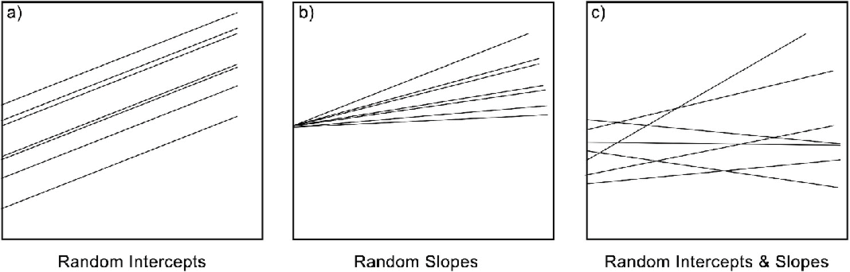

```{r setup, include=FALSE}
knitr::opts_chunk$set(
	echo = TRUE,
	message = FALSE,
	warning = FALSE,
	cache = TRUE
)
```

```{r echo = FALSE, message=FALSE, warning=FALSE}

#  ES482 R labs   
#      University of Victoria, Victoria BC Canada  

#  Statistical Modeling
# Module 3: GLMMs


library(tidyverse)
library(lme4) # fitting glmss
library(MuMIn) # model selection
```


# Materials

## Scripts

1. Click [here](mod_3_glmm.R) to download the script! Save the script to the 'scripts'' folder in your project directory you set up in the previous module.

2. Load your script in RStudio. To do this, open RStudio and click the **files** window and select the scripts folder and then this script.

## Cheat sheets

There are no cheat sheets specific to this module but don't forget the ones you've already printed for previous modules!

## Data

For this module we will continue to work with the cows data from the brown bear conflict data set which should be in the data/raw folder

You can check out this [README file from the Githup repository](data/README.html) to learn more about the data, the data you are working with is *slightly* different from the data in this repository but this will give you a general understanding of the variables and practice with reading/interpreting information from a README file.

# Overview of GLMM

**Generalized linear mixed effects models** (GLMMs) are an extension of GLMs that allow you to model dependence among correlated observations through the use of random (mixed) effect terms.

## Random effects

Recall, with GLMs we model some observed response variable as a function of several other measured variables. These are called **fixed effects** (e.g., independent/explanatory variables) and are things we have measured that we expect to influence our observations in some predictable way. 

**Random effects** on the other hand, represent a variable or potential levels within our population that may cause variability between groups but that we often haven't measured/can't directly. Study design often plays a role in determining the need/identifying potential random effects. If you have observations that are likely to be more similar to one another than the rest of the populations (due to proximity, date of collection, etc) you may want to/need to use a **random effect** term to account for this variation.

For example, in the livestock bear damage data, livestock damage was collected across years. We might suspect that observations within each year are more similar to one another (are correlated) than observations in other years. This could be due to year variations in climate, wildlife demographics, human influence, etc. but we couldn't measure all of these things so instead we can introduce a **random effect** into our models to account for this dependence if it exists. 

## How do random effects affect a model

When you run a GLM without a **random effect** the only source of error for the fixed effects is the random error within a study. However, when you add a **random effect** there are now more (at least two) sources of error to account for, the within-study variability and between-group variability. Thus confidence intervals for population-level (the whole study) **fixed effects** will generally be wider - representing a more conservative estimate of the effect of each variable. 

## Incorporating random effects into a model framework

There are two ways you can incorporate random effects into your model framework,

1. Random intercept model 
2. Random slope model

### Random intercept

A random intercept allows the baseline level of the response variable to vary across groups. 

### Random slope

A random slope allows the effect of a predictor variable to vary across groups.

> You can also model both a random slope and random intercept in your model

The figure below is quite helfpul to illustrate this, from

Fernée, Christianne & Trimmis, Konstantinos. (2021). Detecting variability: A study on the application of bayesian multilevel modelling to archaeological data. Evidence from the Neolithic Adriatic and the Bronze Age Aegean. Journal of Archaeological Science. 128. 10.1016/j.jas.2021.105346.  

<center>



# Code for random effects

Now let's look at how we alter the code for a basic glm to include **random effect/s**. 

First read in the cows data file

```{r}
# Data ----------------------

# Read in data for this module

cows <- read_csv('data/raw/cows.csv',
                 
                 col_types = cols(Damage = col_factor(),
                                  Year = col_factor(),
                                  Month = col_factor(),
                                  Targetspp = col_factor(),
                                  Hunting = col_factor(),
                                  .default = col_number())) %>% 
  
  rename_with(tolower)

# check data structure
str(cows)
```

## Random intercept

Now let's alter the code for the glm in the last module to include a random intercept

### Code

First we have to use a different function from the *lme4* package, `glmer()` allows for random effects  

```{r}
# GLMM ----------------------

# run a global GLM which includes all variables not highly correlated including a random intercept
cows_global_ri <- glmer(damage ~ altitude +
                    bear_abund + 
                     dist_to_forest + 
                     dist_to_town +
                     prop_ag +
                     prop_open +
                     shannondivindex +
                     
                     # random intercept for year
                   (1|year),
                   
                   data = cows, 
                   family = binomial
                   )

summary(cows_global_ri)
```

> You will notice we get a warning message, why is this?

### Scale variables

We didn't scale are variables, random effects models are more sensitive to variables on different scales and recall from GLMs interpreting the effect size (importance) of variables on different scales isn't possible. 

So we need to scale our data, we can either do this directly in the model or mutate the columns. We caled directly in the model last modeul, so I'll do an example where we scale the data before instead


```{r}
# generate new data or overwrite earlier data
cows_scaled <- cows %>% 
  
  mutate_if(is.numeric,
            scale)

head(cows_scaled)
```

Now we will re-run the code from above

```{r}
# run a global GLM which includes all variables not highly correlated including a random intercept
cows_global_ri <- glmer(damage ~ altitude +
                    bear_abund + 
                     dist_to_forest + 
                     dist_to_town +
                     prop_ag +
                     prop_open +
                     shannondivindex +
                     
                     # random intercept for year
                   (1|year),
                   
                   data = cows_scaled, 
                   family = binomial
                   )

summary(cows_global_ri)
```
### Interpret

Now let's look at what information we get from the summary under the random effects: 

This will print our random effect term, specify how we modeled that random effect (intercept or slope) and some statistics we can interpret/report

* Variance : reports the variation in intercepts across year  
* Std.Dev : standard deviation of the estimate on the log-odds scale

> High variance means that the response variable varies substantially between years - ours is close to 0 so likely not contributing a lot


We can also calculate a pseudo r2 values (some packages may print this in the summary) using the *MuMIn* pacakge.


```{r}

r.squaredGLMM(cows_global_ri)
```

This prints two values (marignal and conditional r2) for two different calculations of r2 (theoretical and delta)

The marginal r2 (first value R2m) reports the variance explained by fixed effects - in our case 32.7%

The conditional (second value R2c) reports the variance explained by the full model (fixed and random effects) - in our case 35.7%

> Since the conditional R2 is not much higher than the marginal, our random effect is not explaining much additional variance


*You can also plot the random effects similar to fixed effects to visualize this difference*

## Random slope

To include a random slope we need a numeric variable that we expect to differ year-to-year

```{r}
# run a global GLM which includes all variables not highly correlated including a random intercept
cows_global_rs <- glmer(damage ~ 
                    bear_abund + 
                     dist_to_forest + 
                     dist_to_town +
                     prop_ag +
                     prop_open +
                     shannondivindex +
                     
                     # random slope each year (0 indicates no random intercept)
                   (0 + altitude | year),
                   
                   data = cows_scaled, 
                   family = binomial
                   )

summary(cows_global_rs)
```

Similar terms are reported here

* Variance - how much the effect of altitude on damage varies between years, comparison to mean slope (higher variance = more variable across years)  
* Std.Dev - sqrt of variance = how much the slope of altitude varies across years in units of the variable (larger standard deviation = more variation in the effect of altitude from year to year.)


## Random intercept and slope

We can also include **both** a random intercept and slope if we think this is applicable

```{r}
# run a global GLM which includes all variables not highly correlated including a random intercept
cows_global_r <- glmer(damage ~ 
                    bear_abund + 
                     dist_to_forest + 
                     dist_to_town +
                     prop_ag +
                     prop_open +
                     shannondivindex +
                     
                     # random slope each year (1 indicates a random intercept)
                   (1 + altitude | year),
                   
                   data = cows_scaled, 
                   family = binomial
                   )

summary(cows_global_r)
```
This will print both pieces of information we covered above 

# When to use random effects

Sometimes the study design will dictate whether you are likely to need a random effect or not. For example, if you have a nested study design whereby individual sites are grouped into broader study areas and those study areas differ in some way (e.g. along a rainfall gradient, amount of human disturbance, etc)

Other times, you may expect that there is a grouping variable you expect to generate dependence between samples but it's not necessarily a result of your study design (e.g. you sample across an entire year and you except seasonal variability might contribute). 

If either are the case or you just want to be sure, you can perform model selection on two or more models varying whether random terms are included in those models. 

*There is some debate among statisticians as to how well different model types can be compared in this way, but for now this is generally an acceptable approach if you aren't sure* 

Let's do this with the models we generated above and our original cows_global model without a random term, which we need to paste in and run here

```{r}

# run glm model

cows_global <- glm(damage ~ 
                    bear_abund + 
                     dist_to_forest + 
                     dist_to_town +
                     prop_ag +
                     prop_open +
                     shannondivindex,
                   data = cows_scaled, 
                   family = binomial
                   )

# perform model selection
model.sel(cows_global,
        cows_global_r,
        cows_global_ri,
        cows_global_rs)
```
In this case the model with both a random intercept and slope performs the best, so if this makes ecological sense, it would be justified to include both in our subsequent models.

> Model selection of random terms is generally done before model selection of fixed effects


# Next module

> No assignment for this module, insead start playing with the data for your final report

[--go to next module--](mod_4_occ.html)
