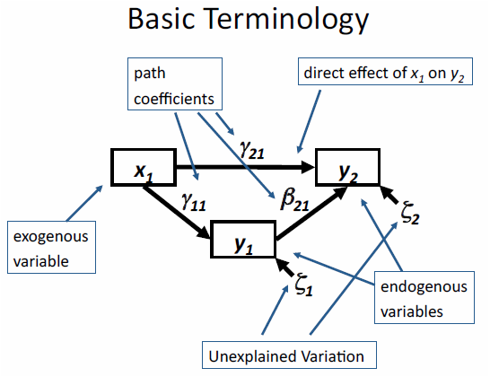
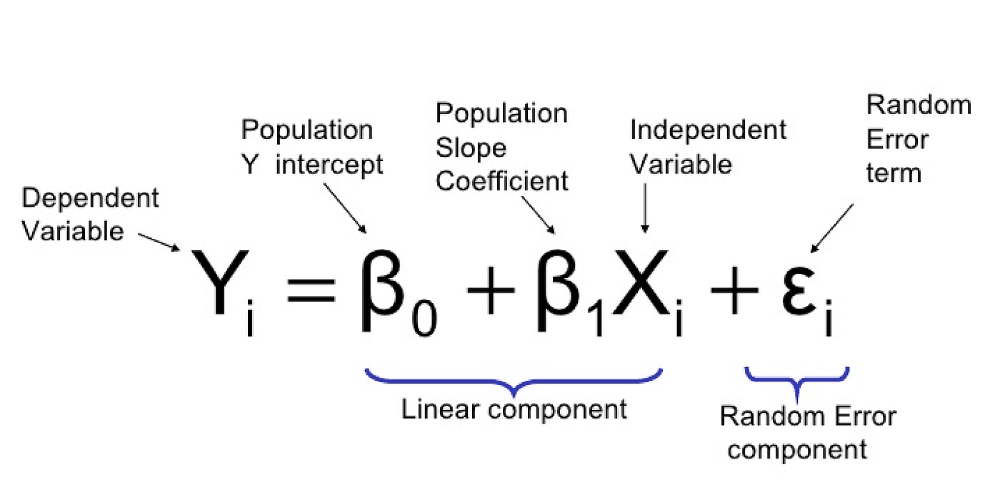
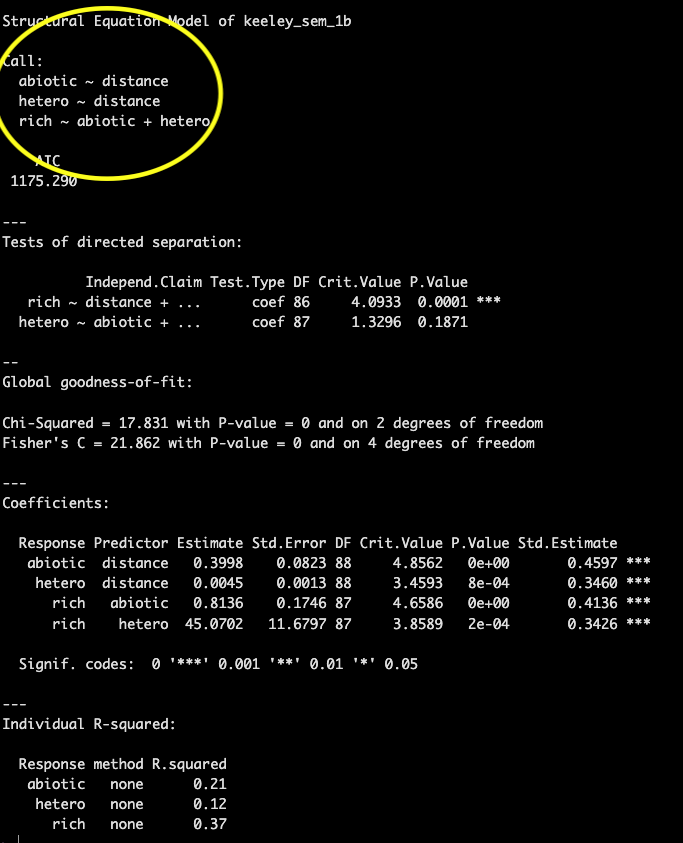
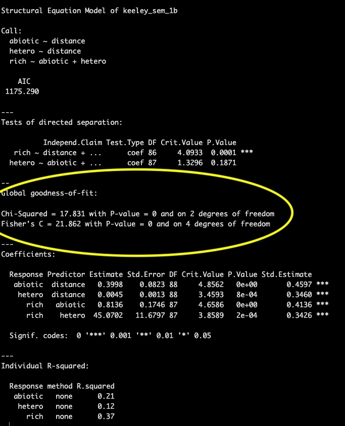

```{r setup, include=FALSE}
knitr::opts_chunk$set(
	echo = TRUE,
	message = FALSE,
	warning = FALSE,
	cache = TRUE
)
```

```{r echo = FALSE, message=FALSE, warning=FALSE}

#  ES482 R labs   
#      University of Victoria, Victoria BC Canada             

#  Statistical Modeling
# Module 5: Structural equation models (SEMs)

# Libraries --------------------

library(piecewiseSEM)

```

## Materials

### Scripts

1. Click [here](mod_5_sem.R) to download the script! Save the script to the 'scripts'' folder in your project directory you set up in the previous module.

2. Load your script in RStudio. To do this, open RStudio and click the **files** window and select the scripts folder and then this script.

### Cheat sheets

There are no cheat sheets specific to this module but don't forget the ones you've already printed for previous modules!

### R documentation

Click [here](images/piecewiseSEM.pdf) to download the R documentation for the piecewsieSEM package

### Video resources

Below our several YouTube videos that provide a good introduction to SEMs

[Intro to Structural Equation Modeling - Johnny Lin](https://www.youtube.com/watch?v=sKVFkVoYfbs)   

*[This website](https://rpubs.com/dsalcido/pathanalysis) pairs with the above video.*   


[Structural Equation Models in Ecology - Jon Lefcheck](https://www.youtube.com/watch?v=VT-gw_VVP1E)    

*A lot of the material and code presented in this module is taken from Lefcheck's seminar on SEM.*

## What is SEM?

Structural equation modeling is a statistical approach that allows us to test multiple (network) hypotheses regarding the relationships between multiple variables in our data simultaneously. The name itself tells us a lot about how these models work

### Structural

Implies that there is an underlying structure (cause and effect) and we have a hypothesis regarding what that underlying structure is.

### Equation

These hypotheses can then be translated to a series of mathematical equations ( individual general linear regressions) that are grouped within a single causal network. These equations are particularly useful to assess direct AND indirect effects within a system.

### Modeling

We can then fit these equations to data to support or refute our hypothesized structure.

> With SEMs our analysis is heavily reliant on the hypothesized underlying structure (our proposed causes and effects) so it is crucial when applying SEM that you have a strong understanding of your system. 

And a model is not set in stone, adjustments can be made to the hypothesized structure as new information becomes available and from the results of the analysis in an iterative fashion.

### Path diagrams

**Path diagrams** are a graphical tool used with SEMs to depict the relationships between variables (structured equations). There is a somewhat standardized way of presenting a path diagram shown in the example below as well as common terminology to be familiar with.

   

In the diagram above there are **exogenous** and **endogenous** variables represented by the rectangles.

- **Exogenous variables** are independent variables that explain one or more **endogenous** variables, meaning they only have arrows pointing away from them and not towards them (solely explanatory variables) and when translated to a formula they will never be on the left side of the '~'.

- **Endogenous variables** are dependent (response) variables that are explained by other variables in the model. Thus arrows point towards them (and can also point away) representing causal paths.

Both **exogenous** and **endogenous** variables can be either **observed** or **latent** variables. **Observed** variables are most common and are variables for which we can measure and have data for. **Latent** variables are unmeasured variables which can also be modeled with SEMs but we will not be covering that in this module. **Observed** and **latent** variables are often represented with different shapes in a **path diagram**.

- Arrows represent relationships among variables, the variable the arrow is pointing to is the dependent (response) variable and the variable the arrow is pointing away from is the independent (explanatory) variable.

We can break down the above diagram into individual structured equations in a format you are likely more familiar with using the equation for a linear regression.

{width=60%}

The *simplified* individual equations for the diagram above would be as follows

- y1 ~ x1   
- y2 ~ x1 + y1    

In these simplified formulas we have not written out the slope terms, but they are estimated from the model, or error terms. But as with all statistical analysis there is some amount of error associated with estimating one variable from another and this can be represented graphically in a **path diagram** as shown below.


There may also be variables in your **path diagram** that co-vary, but you don't expect to have a causal relationship. These are depicted often depicted in diagrams with curved arrows and can be modeled using the syntax below

y1 covariance with y2   
- y1 ~~ y2

## SEM in R

### PiecewiseSEM package

There are multiple packages available in R for SEM analysis, the one we will focus on is the *PiecewiseSEM* package developed my Jon Lefcheck. This adaptation of SEM is informed by graph theory and varies from older approaches to SEM in that instead of estimating a single global matrix which includes all the variables at once it estimates each equation individually which increases the flexibility of the analysis. Each equation can have different assumptions, different error distributions, fitting functions, etc. This makes PiecewiseSEM useful for messy data we are often working with in ecology.

Another common SEM package is the *lavaan* package, which has less flexibility but is maybe more widely known as it was developed earlier. Click [here](https://lavaan.ugent.be/tutorial/sem.html) a short SEM example with the *lavaan* package.    

First we need to install and load the *PiecewiseSEM* package.

```{r eval=FALSE}
# Libraries ----------------------

# install package
install.packages("piecewiseSEM")

# load library
library(piecewiseSEM)
```

### Data

For this example we will be working with the *keeley* data set which is loaded with the *piecewiseSEM* package. This is from [Grace and Keeley 2006](https://esajournals.onlinelibrary.wiley.com/doi/full/10.1890/1051-0761%282006%29016%5B0503%3AASEMAO%5D2.0.CO%3B2) paper published in *Ecological Applications* 

Let's load the keeley data and take a look at it
```{r}
# Data ----------------------

# Load Keeley data set
data(keeley)

# Examine Keeley data
head(keeley)

```

This data set contains 90 observations of 8 plant community metrics and is used frequently as an example with SEM data. For more information on the keeley data you can reference the help file
```{r}
# learn more about keeley data
?piecewiseSEM::keeley
```

### Fit SEM to data

*The following code and images are taken from Lefcheck's seminar in the statistical methods series, which is linked above*

There are multiple ways to fit a structural equation model to your data in R but both require that you break down the components of your network into individual component regressions.

Let's say this is your hypothesized network structure


For each of the **endogenous variables** (dependent variables) you must write a regression equation.

```{r}
# SEM model ----------------------

# option 1 to fit SEM model to data
# Break down component regressions

abiotic_model <- lm(abiotic ~ distance, data = keeley)
hetero_model <- lm(hetero ~ distance, data = keeley)
richness_model <- lm(rich ~ abiotic + hetero, data = keeley)

# Use the `psem` function to create the SEM
keeley_sem_1a <- psem(abiotic_model, hetero_model, richness_model)


# option 2
# nest the component regressions inside the 'psem' function

keeley_sem_1b <- psem(
  lm(abiotic ~ distance, data = keeley),
  lm(hetero ~ distance, data = keeley),
  lm(rich ~ abiotic + hetero, data = keeley)
)


```

### Interpreting model output

As with other regression models, we can use the `summary()` **function** to examine our SEM

```{r}

summary(keeley_sem_1b)

# can run the code below to check that both ways of fitting an SEM to your data have the same result
# summary(keeley_sem_1a)

```

Also similar to other model summaries the first bit of information that it printed with the `summary()` **function** is the 'Call:' which provides the equations for each component of your SEM.



This is followed by an AIC score which can be used to compare models.

Then we get into some information that may be new to you, a printout of the test of directed separation. This is a function built in to the *piecewiseSEM* package that assesses independence claims (missing pathways) in your network. Basically for any variables without a path coefficient (arrow between them in your **path diagram**) this function will evaluate the importance and provide a p-value associated with that path coefficient. This can be used to evaluate your model in case there were causal pathways between variables you did not predict. 


If there are many independence claims that are significant and are not included in your SEM structure it is likely your model will have a poor fit.

Goodness of fit is presented in the next section. Both the chi-squared and Fisher's C test are testing a null hypothesis that the actual data structure does not differ significantly from the proposed model structure and therefore we want to fail to reject the null hypothesis (e.g., p-value > 0.05). A higher p-value for the goodness of fit means that the model structure is not significantly different than implied by the data. 



In this example the p-value is 0, indicating poor model fit.

<center>
{width=40%}
</center>